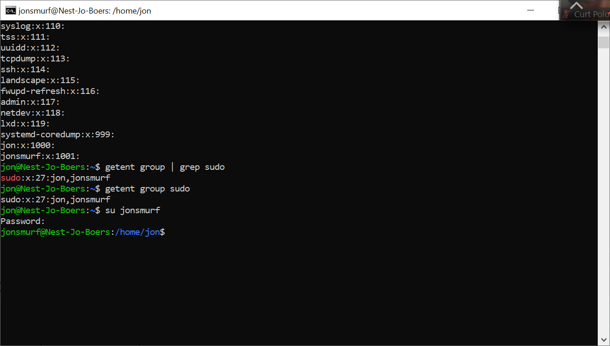
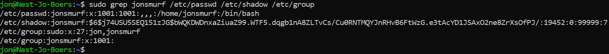

# Users and groups
Linux has users, similar to accounts on Windows and MacOS. Every user has their own home directory. Users can also be part of groups.
There is a special user called ‘root’. Root is allowed to do anything.
To gain temporary root permissions, you can type ‘sudo’ in front of a command, but that only works if you’re allowed to do that.

Some actions require specific permissions like root permissions.

Users, passwords, and groups are all stored in different files across the system.

## Key-terms

sudo adduser &lt;username&gt; adds a new user  
sudo grep &lt;username&gt; /etc/passwd /etc/shadow /etc/group    
[sudo] is alleen nodig voor /etc/shadow, maar zo staat het in 1 regel  

## Opdracht
### Gebruikte bronnen

https://www.cyberciti.biz/faq/where-are-the-passwords-of-the-users-located-in-linux/#:~:text=All%20modern%20Linux%20operating,the%20%2Fetc%2Fpasswd%20file.

https://www.cyberciti.biz/faq/where-are-the-passwords-of-the-users-located-in-linux/#:~:text=All%20modern%20Linux%20operating,the%20%2Fetc%2Fpasswd%20file.

### Ervaren problemen

### Resultaat

Create a new user in your VM.  
The new user should be part of an admin group.  
The new user should have a password.  
The new user should be able to use ‘sudo’  

Locate the files that store users, passwords, and groups. See if you can find your newly created user’s data in there.

