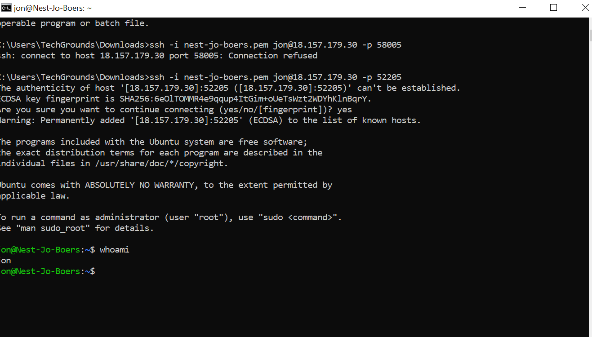

# [Setting up]

Introduction:
Linux, like Windows or MacOS, is an operating system. It manages the communication between the physical device (hardware) and all computer programs (software).
Linux is the most popular operating system for servers, because it is lightweight, stable, highly customizable, and free to use. Due to the open source licensing, everyone is allowed to build and distribute new versions of Linux.

In Linux, the graphical user interface (GUI) is considered to be optional. You control it using a command line (CLI), typing in commands. It is important to get somewhat comfortable with the CLI. Although we will have a GUI, for now. That won’t always be the case.

Using a virtual machine (VM), you can run a Linux machine within your own computer (an OS within an OS). A hypervisor will assign a part of your hardware to the virtual machine. When setting up a VM in the cloud, a type 1 hypervisor is used to allocate hardware to your VM.

During this course we will run a Linux distribution called Ubuntu. In the background there is a VM running on AWS. Within that VM we have created a container for every student. This container acts like a clean instance of Ubuntu. There is no GUI installed, so you will have to use the CLI.

The VM is Located in Frankfurt, so you will need to create a remote connection to your machine. Remote connections to a Linux machine are usually done using the Secure Shell (SSH) protocol.

Requirements:
The email from your Learning Coach 
If you’re using a Windows machine: OpenSSH
If you’re using a MacOS or Linux machine: Access ssh using your terminal

## Key-terms
[Schrijf hier een lijst met belangrijke termen met eventueel een korte uitleg.]

## Opdracht
### Gebruikte bronnen
[Plaats hier de bronnen die je hebt gebruikt.]

### Ervaren problemen
[Geef een korte beschrijving van de problemen waar je tegenaan bent gelopen met je gevonden oplossing.]

### Resultaat

Exercise:
Make an SSH-connection to your virtual machine. SSH requires the key file to have specific permissions, so you might need to change those.
When the connection is successful, type whoami in the terminal. This command should show your username.

