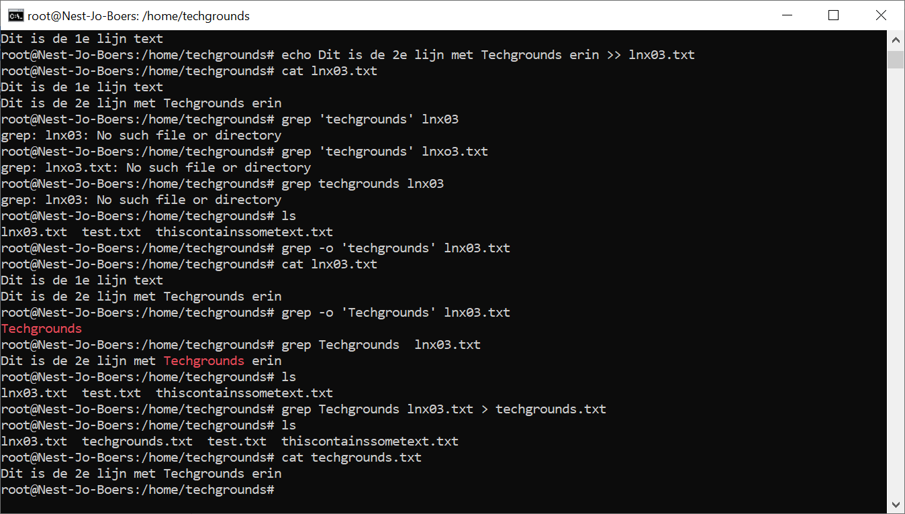

# [Working with text (CLI)]

Introduction:
Every command in Linux has a standard input and output.
The standard input (stdin) is the keyboard. If I run ‘mkdir myfolder’, the mkdir command will know what folder to create, because I typed ‘myfolder’ using my keyboard.
The standard output (stdout) is the terminal. The command ‘echo hello’ will write ‘hello’ in the terminal.

Both the input and output can be redirected to a file instead of the default. This is called input redirection and output redirection. 
A pipe can be used to have the output of one command be the input of another command.

Requirements:
Your Linux machine
A text file with 2 lines of text

## Key-terms
[Schrijf hier een lijst met belangrijke termen met eventueel een korte uitleg.]

## Opdracht

### Gebruikte bronnen
[Plaats hier de bronnen die je hebt gebruikt.]

### Ervaren problemen
[Geef een korte beschrijving van de problemen waar je tegenaan bent gelopen met je gevonden oplossing.]

### Resultaat
Exercise:
Use the echo command and output redirection to write a new sentence into your text file using the command line. The new sentence should contain the word ‘techgrounds’.
Use a command to write the contents of your text file to the terminal. Make use of a command to filter the output so that only the sentence containing ‘techgrounds’ appears.
Read your text file with the command used in the second step, once again filtering for the word ‘techgrounds’. This time, redirect the output to a new file called ‘techgrounds.txt’.

