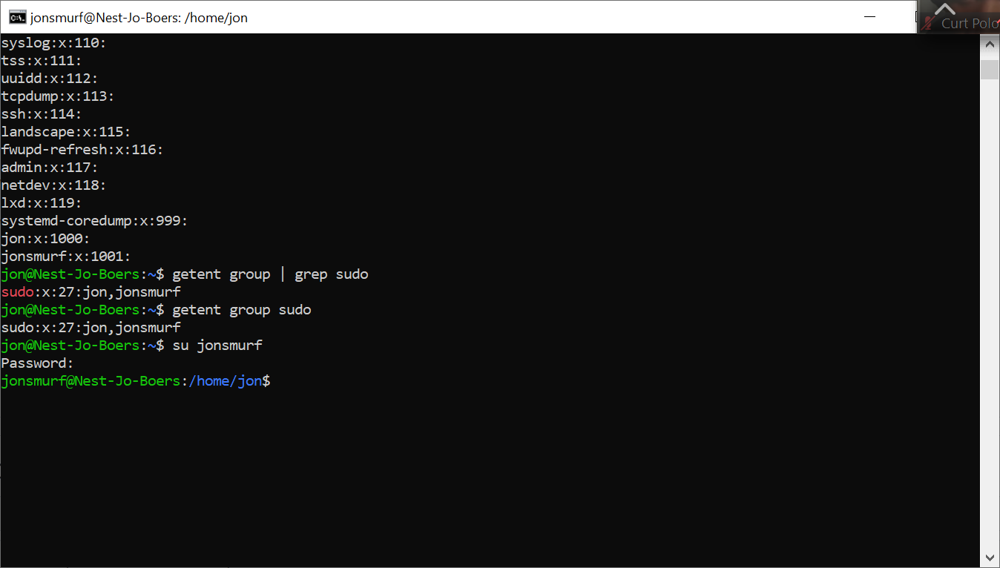

# Users and groups
Linux has users, similar to accounts on Windows and MacOS. Every user has their own home directory. Users can also be part of groups.
There is a special user called ‘root’. Root is allowed to do anything.
To gain temporary root permissions, you can type ‘sudo’ in front of a command, but that only works if you’re allowed to do that.

Some actions require specific permissions like root permissions.

Users, passwords, and groups are all stored in different files across the system.

## Key-terms
[Schrijf hier een lijst met belangrijke termen met eventueel een korte uitleg.]

## Opdracht
### Gebruikte bronnen
[Plaats hier de bronnen die je hebt gebruikt.]

### Ervaren problemen
[Geef een korte beschrijving van de problemen waar je tegenaan bent gelopen met je gevonden oplossing.]

### Resultaat

Create a new user in your VM.  
The new user should be part of an admin group.  
The new user should have a password.  
The new user should be able to use ‘sudo’  

Locate the files that store users, passwords, and groups. See if you can find your newly created user’s data in there.

