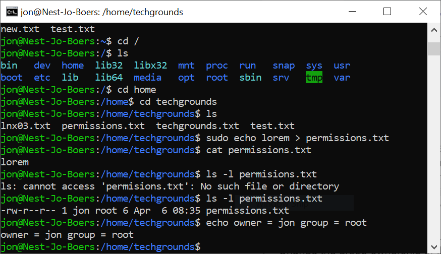
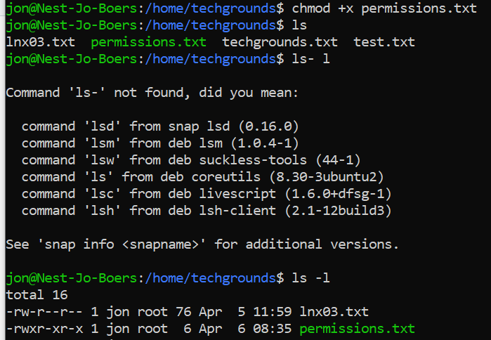
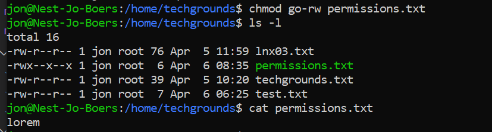
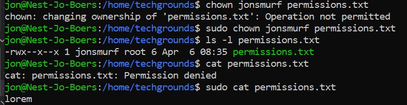
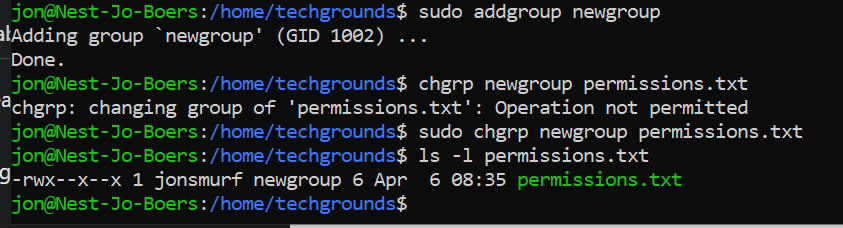

# File Permissions
Every file in Linux contains a set of permissions. There are separate permissions for reading, writing, and executing files (rwx). There’s also three types of entities that can have different permissions: the owner of the file, a group, and everyone else. Root does not need permissions to read, write or execute a file.

You can view a file’s permissions by creating a long listing. A file’s permissions, as well as its owner and group, can be changed as well.
Any user listed in /etc/passwd can be assigned as owner of a file.
Any group listed in /etc/group can be assigned as the group of a file.

## Key-terms
chmod g-w this command removes write permission for group.

chmod go-rwx this command removes read, write, and execute permission for group and others.

chmod o+w this command adds write permission for others.

chmod +x "filename" this command adds executable permission to the file

ls -l generates a list in long format

addgroup adds a group

chgrp "filename" changes the group

chgrp <g>

## Opdracht
### Gebruikte bronnen
https://sites.google.com/site/tipsandtricksforubuntu/executable-files

https://www.linuxlinks.com/linux-starters-guide-linux-files-permissions/2/

Mijn team

### Ervaren problemen

### Resultaat

Create a text file.
Make a long listing to view the file’s permissions. Who is the file’s owner and group? What kind of permissions does the file have?

Make the file executable by adding the execute permission (x).

Remove the read and write permissions (rw) from the file for the group and everyone else, but not for the owner. Can you still read it?

Change the owner of the file to a different user. If everything went well, you shouldn’t be able to read the file unless you assume root privileges with ‘sudo’.

Change the group ownership of the file to a different group.

