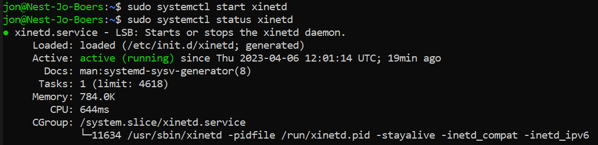

# Processes

Processes in Linux can be divided into three categories: Daemons, Services, and Programs.
A daemon runs in the background and is non-interactive. A Service responds to requests from programs. A service may be interactive. A program is run and used by users (e.g. Vim).

In order to connect to remote Linux machines (virtual or not), you can use ssh (secure shell). To make this connection to your machine possible, you’ll have to start the ssh service by starting the ssh daemon. Before ssh there was telnet, which basically does the same thing, except the connection is not encrypted, so it is not secure. In this exercise we will use telnet for the sake of not messing with our ssh connection, but it is not recommended for use.

A process is an instance of running code. All code is stored in files somewhere on the system. In order to find these files, Linux will look in the $PATH variable (more about that in a later exercise). Every process has its own PID (Process ID) number.

## Key-terms

sudo apt-get install telnetd; installeert telnetd  
sudo apt-get install xinetd; installeert xinetd  
sudo systemctl start xinetd; start xinetd  
sudo systemctl status xinetd; checkt de status van xinetd zodat je kan zien of het actief is etc.   
sudo systemctl stop xinetd; stopt xinetd  
sudo kill [PID nummer]; 'kills' xinetd  

## Opdracht
### Gebruikte bronnen

https://linuxhint.com/find-process-id-ubuntu/

https://askubuntu.com/questions/439574/telnet-server-not-starting

### Ervaren problemen

Het starten van telnet lukte niet met 'sudo systemctl start telnet.socket';
Failed to start telnet.socket: Unit telnet.socket not found

...maar na het installeren van xinetd met 'sudo apt-get install xinetd' lukte het wel

Het PID nummer was niet zichtbaar na de eerste opstart, maar na het stoppen en opnieuw opstarten wel.

### Resultaat

Start the telnet daemon.

Find out the PID of the telnet daemon.

Find out how much memory telnetd is using.

Stop or kill the telnetd process.

