# Bash scripting
The default command line interface in Linux is called a Bash shell. You’ve already interacted with Linux using commands in this shell.
A Bash script is a series of commands written in a text file. You can execute multiple commands in a row by just executing the script.
Additional logic can be applied with the use of variables, conditions, and loops among others.

In order to be able to execute the script, a user needs to have permissions to execute (x) the file.
Linux will only be able to find the script if you specify the path name, or if you add the path to the directory in which the script lives to the PATH variable.

Hint: although there are no file extensions in Linux, it’s easier for humans to understand if you end your script names with ‘.sh’.

## Key-terms

mkdir ; make directory  
which bash ; laat zien wat het pad is naar de bash interpreter  
export PATH=$PATH:/home/jon/scripts ; voegt de 'scripts' directory toe aan de $PATH variabel  
echo $PATH ; controle of bovenstaande is gelukt  
nano ~/.bashrc ; opent de ~/.bashrc file in de nano editor 
touch firstscript.sh ; maakt mijn eerste script ooit
 

## Opdracht
### Gebruikte bronnen

https://www.redhat.com/sysadmin/create-delete-files-directories-linux#:~:text=Create%20a%20directory&text=The%20basic%20syntax%20for%20using,Linux%20filesystems%20are%20case%2Dsensitive.

https://www.freecodecamp.org/news/bash-scripting-tutorial-linux-shell-script-and-command-line-for-beginners/

https://linuxhint.com/bash_conditional_statement/

https://youtube.com/playlist?list=PLtK75qxsQaMLZSo7KL-PmiRarU7hrpnwK

https://www.digitalocean.com/community/tutorials/how-to-install-the-apache-web-server-on-ubuntu-20-04

### Ervaren problemen
vergeten .sh achter mijn scriptnaam te zetten  
vergeten .txt file aan te maken waar het script naartoe moest schrijven  
script file in de verkeerde locatie gezet, opgelost met 'mv'  
vergeten script executable te maken  

Failed to start httpd.service: Unit httpd.service not found.
Failed to enable unit: Unit file httpd.service does not exist.
Unit httpd.service could not be found. Kortom vertrouw chatgpt niet tenzij je genoeg tijd hebt.

### Resultaat

Exercise 1:
Create a directory called ‘scripts’. Place all the scripts you make in this directory.
Add the scripts directory to the PATH variable.

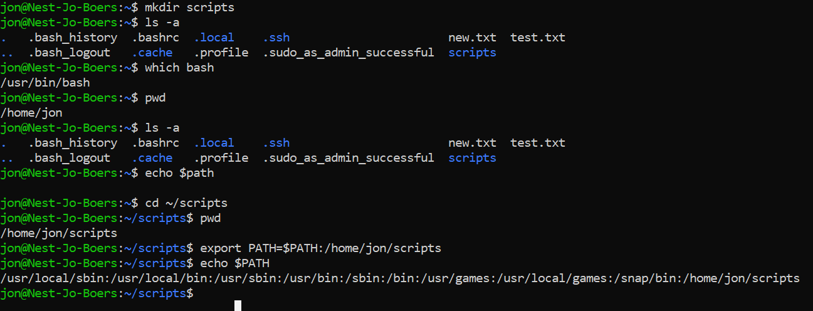

To make the above permanent i added the scripts directory path to $PATH in the ~/.bashrc file in the nano editor  : 

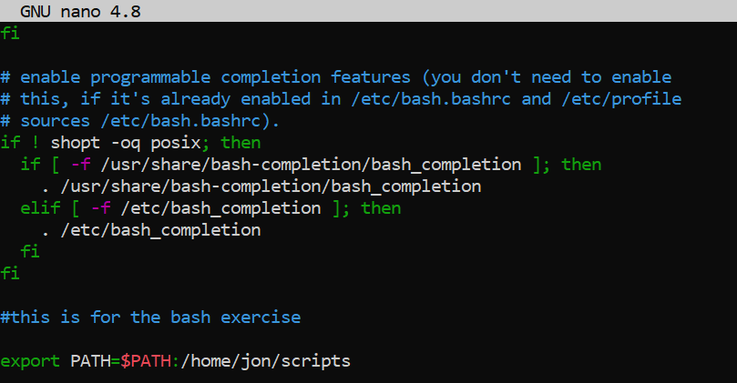

test:

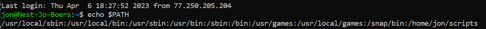

Create a script that appends a line of text to a text file whenever it is executed.

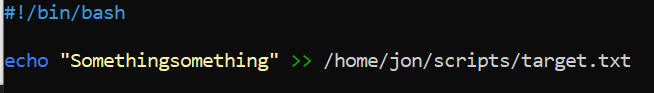
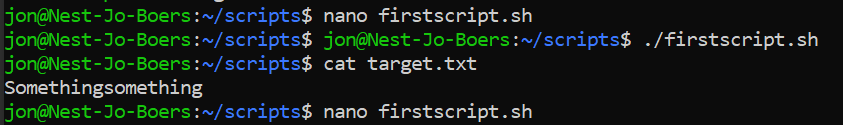  

Create a script that installs the httpd package, activates httpd, and enables httpd. Finally, your script should print the status of httpd in the terminal.

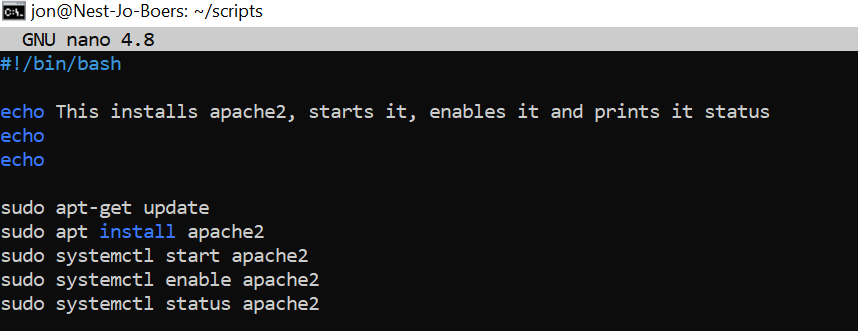

outcome:

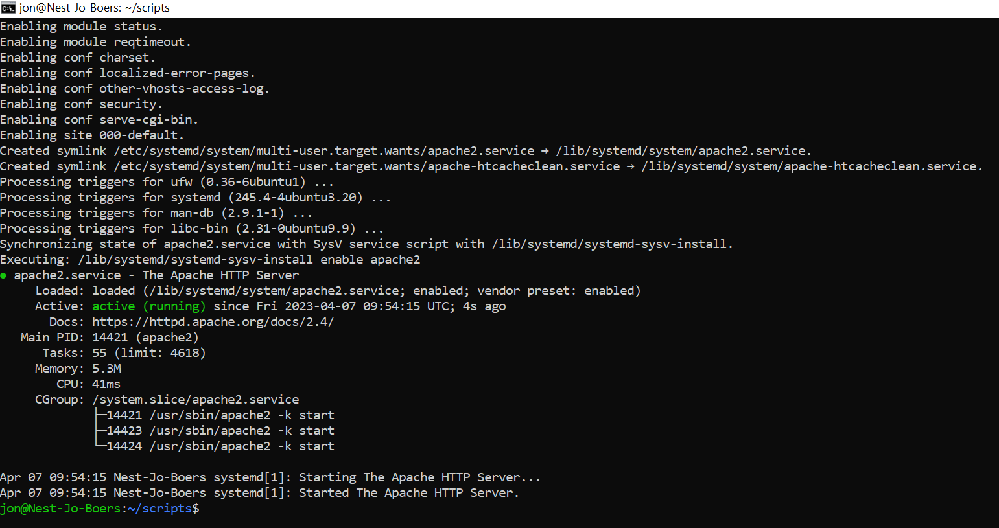

Variables:
You can assign a value to a string of characters so that the value can be read somewhere else in the script.
Assigning a variable is done using ‘=’.
Reading the value of a variable is done using ‘$<insert variable name here>’.

Exercise 2:
Create a script that generates a random number between 1 and 10, stores it in a variable, and then appends the number to a text file.

script:

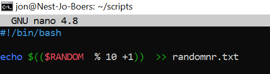

outcome:

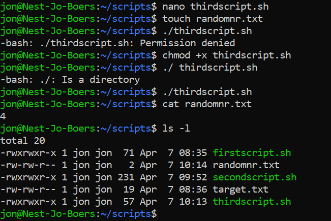

Conditions:
You can choose to only run parts of your script if a certain condition is met. For example, only read a file if the file exists, or only write to a log if the health check returns an error. This can be done using conditions.

A check for a condition can be done using ‘if’, ‘elif’, and/or ‘else’.

Exercise 3:
Create a script that generates a random number between 1 and 10, stores it in a variable, and then appends the number to a text file only if the number is bigger than 5. If the number is 5 or smaller, it should append a line of text to that same text file instead.

script:

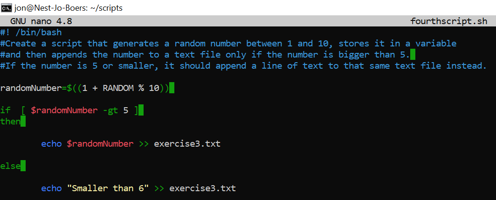

output:

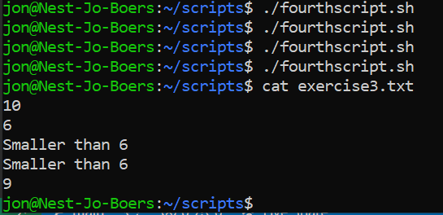
