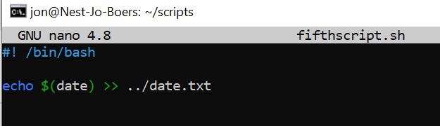
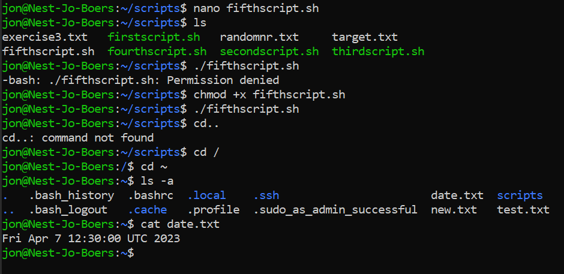

# Cron Jobs
There might be processes that you want to execute on a regular schedule. For example, you might want to write the available disk space to a log file every hour. Or maybe you want to check for system updates every 2nd day of the month.

These kinds of jobs can be automated using Cron jobs.

## Key-terms
echo $(date) >> ../date.txt ; schrijft de datum naar een tekstbestand in mijn homefolder  
$ crontab -e ; opent een editor voor mijn gebruikers crontab  

## Opdracht
### Gebruikte bronnen
https://crontab.guru/  
https://www.baeldung.com/linux/create-crontab-script

### Ervaren problemen

### Resultaat

Create a Bash script that writes the current date and time to a file in your home directory.

output:

Register the script in your crontab so that it runs every minute.

Create a script that writes available disk space to a log file in ‘/var/logs’. Use a cron job so that it runs weekly.
