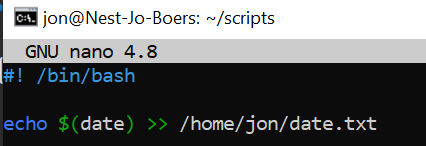
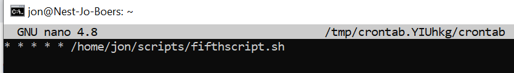
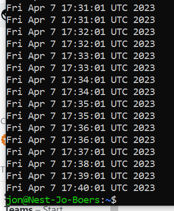

# Cron Jobs
There might be processes that you want to execute on a regular schedule. For example, you might want to write the available disk space to a log file every hour. Or maybe you want to check for system updates every 2nd day of the month.

These kinds of jobs can be automated using Cron jobs.

## Key-terms
echo $(date) >> /home/jon/date.txt ; schrijft de datum naar een tekstbestand in mijn homefolder  
crontab -e ; opent een editor voor mijn gebruikers crontab  

## Opdracht
### Gebruikte bronnen

https://crontab.guru/  
https://www.baeldung.com/linux/create-crontab-script
https://serverfault.com/questions/449651/why-is-my-crontab-not-working-and-how-can-i-troubleshoot-it

### Ervaren problemen

Het registreren van het script in mijn crontab lukte maar niet omdat het pad in mijn script niet
klopte. Dit opgelost met hulp van Curt, Akram, Quincy, Sjoerd, Anj en uiteindelijk Casper. 

### Resultaat

Create a Bash script that writes the current date and time to a file in your home directory.

The above works fine as long as I'm in the home directory, but an absolute path had to be added
in order to  also work in my crontab therefore this correction:   

output:

Register the script in your crontab so that it runs every minute.

output using "cat date.txt":

notice the identical lines because i also created a sudo crontab because of the
trouble-shooting. Eventually removed the sudo crontab cause the list is long enough as it is.

Create a script that writes available disk space to a log file in ‘/var/logs’. Use a cron job so that it runs weekly.
