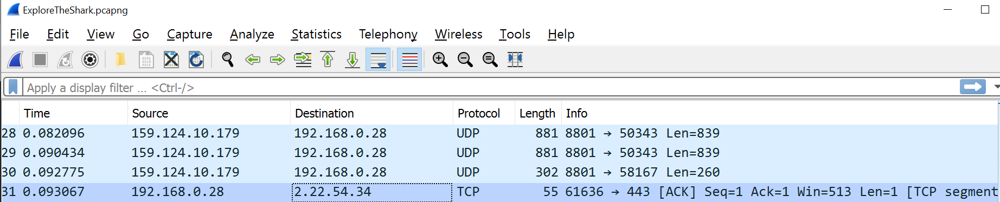

# Protocols

Introduction:
A network protocol is an agreement about how to communicate. There are protocols on every layer of the OSI stack.

The layer 4 protocols, TCP and UDP, are responsible for transporting internet packets. UDP utilises a ‘fire and forget’ strategy, whereas TCP utilises a ‘Three-way handshake’. TCP is therefore more reliable, but UDP is significantly faster.

Protocols in higher layers, like HTTPS and SSH, all have their own use cases. Most of these protocols have a default port number.

Requirements:
Wireshark

## Key-terms

See below at OSI model

## Opdracht
### Gebruikte bronnen
https://docs.oracle.com/cd/E19683-01/806-4075/ipov-10/index.html
https://en.wikipedia.org/wiki/List_of_network_protocols_(OSI_model)
https://www.internetx.com/en/news-detailview/who-creates-the-standards-and-protocols-for-the-internet/
https://www.w3.org/
https://www.quora.com/How-would-one-create-and-implement-their-own-networking-protocol
https://www.whois.com/whois
Sage
Chatgpt

### Ervaren problemen

### Resultaat

Exercise :
**Identify several other protocols and their associated OSI layer. Name at least one for each layer.**

7.  Application layer;      DHCP Dynamic Host Configuration Protocol, FTP File Transfer Protocol
6.  Presentation layer;     TLS Transport Layer Security
5.  Session layer;          NetBIOS, File Sharing and Name Resolution protocol - the basis of file sharing with Windows.
4.  Transport layer;        TCP Transmission Control Protocol, UDP User Datagram Protocol
3.  Network layer;          SCCP Signalling Connection Control Part, VRRP Virtual Router Redundancy Protocol       
2.  Data link layer;        ARP Address Resolution Protocol, MAC Media Access Control
1.  Physical layer;         USB Universal Serial Bus, IrDa, ISDN

**Figure out who determines what protocols we use and what is needed to introduce your own protocol.**

World Wide Web consortium (W3C):
The W3C is a global community that develops open standards to ensure the long-term growth and evolution of the web. The W3C develops a range of technical specifications for web technologies such as HTML, CSS, and XML, as well as for protocols such as HTTP and WebSocket.

Telecommunication Standardization Sector (ITU-T):
The International Telecommunication Union – Telecommunication Standardization Bureau (ITU-T) is the division of the ITU responsible for standards in the telecommunications and information communications (ICTs) technology sectors with are located in Geneva, Switzerland. The foundation of the ITU goes back to Napoleon III when the French government invited international guests to Paris to facilitate and regulate international telegraph services. This organization oversees technical standards in its specialized field to ensure they are rolled out efficiently and on time. The ITU-T standards are published as Recommendations, but they become de facto mandatory when adopted by national law. Since ITU is a specialized United Nations agency, their standards have a more international weight than other technical specifications.

Internet Architecture Board (IAB)
The Internet Architecture Board (IAB) is an organization established both as a commission of the Internet Engineering Task Force (IETF) and as an advisory body of the Internet Society (ISOC). The IAB is responsible in particular for the:
technical consultation of the ISOC, since it oversees the development of the TCP/IP Protocol Suite
management of the IETF activities and the internet standards process
support of researchers in the internet community
editorial RFCs management
administration of the IETF protocol parameter registers.
Initially, the United States Department of Defense Advanced Research Projects Agency (DARPA) established the organization with the name Internet Configuration Control Board (ICCB) in 1979. This body was reorganized as the Internet Activities Board in 1983 with working groups dedicated to different technical aspects of the internet. In January 1992, under ISOC, the organization was renamed Internet Architecture Board as part of the internet's transition from a US-government entity to an international, public entity. Nowadays, among others, the IAB is working with ICANN to develop the DNS Root System.

Internet Society (ISOC)
The Internet Society is an American nonprofit advocacy organization created in 1992 to support the development process for internet standards. As they state, their mission is "to promote the open development, evolution, and use of the Internet for the benefit of all people throughout the world." ISOC leaders collaborate with other groups such as IAB and IETF in creating internet policy planning. ISOC offers regular meetings, workshops, and conferences to raise awareness on different internet-related topics.

Internet Engineering Task Force (IETF)
The Internet Engineering Task Force (IETF) operates as an activity of the Internet Engineering Steering Group (IESG). It comprises different working groups dedicated to a specific engineering and standards-making problem with a short lifespan. IETF receives decisions from the working group, identifies operational issues of the internet, proposes solutions, and develops and reviews specifications. The IETF has the technical competence to collect input from any source and turn them into network engineering principles.

Internet Research Task Force (IRTF)
The Internet Research Task Force is a self-organized group. It focuses on long-term research issues to evolve internet protocols, applications, architecture, and technology. Unlike other organizations, individual contributors run the IRTF rather than representatives. The IRTF organizes the ACM/IRTF Applied Networking Research Workshop and the Applied Networking Research Prize to promote the collaboration between the academic research world and the internet standards community.

Institute of Electrical and Electronics Engineers (IEEE)
The Institute of Electrical and Electronics Engineers (IEEE - commonly pronounced I-triple-E) is dedicated to engineering and electrical engineering. The institute was born in 1963 from the American Institute of Electrical Engineers and the Institute of Radio Engineers. With more than 423,000 members around the globe, it is the largest association of technical professionals worldwide. Today IEEE produces over 30% of the world's literature in electrical and electronics engineering, including computer science and related fields. Since 1997, it has published the peer-reviewed journal IEEE Internet Computing covering all emerging and maturing internet technologies.

Internet Corporation for Assigned Names and Numbers (ICANN)
The Internet Corporation for Assigned Names and Numbers was founded in California in 1988 to ensure the operational stability of the internet, with particular regard to DNS. It is a technical coordinating and regulatory body. ICANN coordinates and maintains several databases related to the namespaces and numerical spaces of the internet. It introduced the new gTLDs and included the internet protocol address spaces for IPv4 and IPv6, assigning address blocks to regional internet registries.

Creating and implementing your own networking protocol can be a complex and time-consuming task. It typically involves the following steps:

Define the problem: Determine the specific problem or need that your protocol will address. This might include issues with existing protocols, such as security vulnerabilities or lack of scalability.

Design the protocol: Develop a detailed design for your protocol, including the various components, such as the packet format, data encoding, and error handling.

Implement the protocol: Write the code for the protocol using a programming language such as C or Python. This will involve creating the various components of the protocol, such as the packet format, data encoding, and error handling.

Test the protocol: Test the protocol to ensure it is functioning as expected and to identify any bugs or issues that need to be addressed.

Deploy the protocol: Deploy the protocol in a test environment, and then in a production environment. This will involve configuring the necessary hardware and software, and training users on how to use the protocol.

**Look into wireshark and install this program. Try and capture a bit of your own network data. Search for a protocol you know and try to understand how it functions.**

The Above screenshot shows an ACK packet, which is used to acknowledge receipt of data that has been received. In this case, the packet is acknowledging receipt of data sent from the destination host (2.22.54.34) to the source host (192.168.0.28) over an existing TCP connection (with source port 61636 and destination port 443).  

