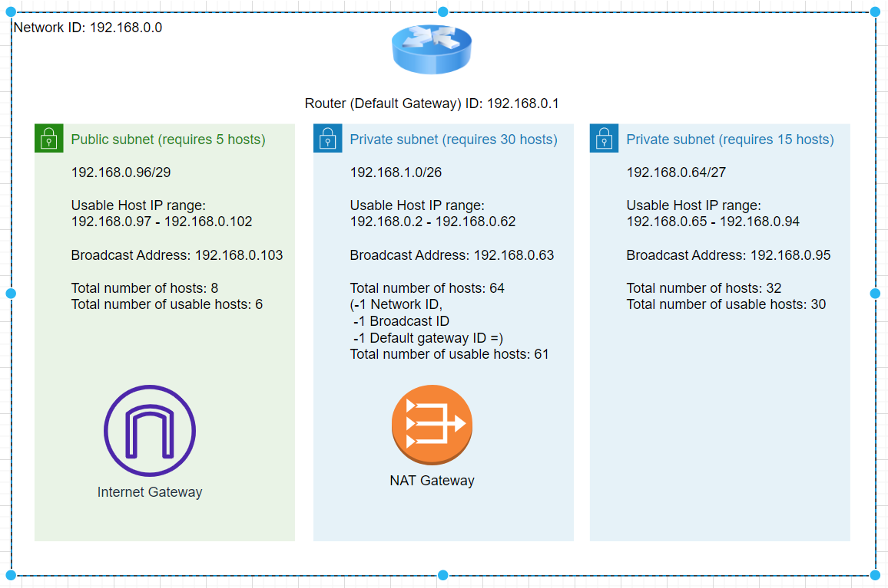

# Subnetting

Introductie:
Een netwerk is gedefinieerd als twee of meer devices die met elkaar verbonden zijn zodat ze data kunnen uitwisselen. Een Local Area Network (LAN) wordt vaak uitgedrukt als een range aan IP addresses. Elk device (host) krijgt een eigen adres binnen die range.

Om dit te ondersteunen hebben netwerken een subnet mask (prefix) die definieert hoeveel bits van het IP adres onderdeel uitmaken van het netwerkadres, en hoeveel bits gereserveerd zijn voor de host.

Een subnet is een kleiner netwerk dat onderdeel is van een groter netwerk. Subnets kunnen worden gebruikt om een deel van het netwerk logisch te isoleren. Een subnet heeft per definitie een grotere prefix dan het netwerk waar het subnet in zit.

Om dit alles leesbaar te maken voor mensen maken we gebruik van CIDR notation.

Benodigdheden:
https://app.diagrams.net/
Een subnet calculator

## Key-terms

**Subnetting:** Subnetting is the process of dividing a larger network into smaller subnetworks, or subnets. Subnetting is commonly used in computer networking to improve network performance, security, and management.

In a subnetted network, the IP address space is divided into smaller groups of addresses, which are assigned to individual subnets. Each subnet can then be managed separately, with its own set of network policies and security measures.

Subnetting also allows for more efficient use of IP address space. Without subnetting, a network may be allocated a large range of IP addresses, many of which may not be used. Subnetting allows for the allocation of smaller blocks of IP addresses, which can reduce wastage and improve address utilization.

Subnetting is an important concept in networking and is commonly used in the design and configuration of modern computer networks.

**CIDR (Classless Inter-Domain Routing)** is a method of IP address allocation and routing that replaces the traditional Class A, B, and C networks. It allows for more efficient use of IP address space by enabling the allocation of variable-length subnet masks (VLSMs) that can divide a larger network into smaller subnets.

CIDR uses a notation that includes the IP address followed by a forward slash (/) and a number indicating the length of the prefix, which is the number of bits used to identify the network. For example, the CIDR notation for a network with an IP address of 192.168.0.0 and a subnet mask of 255.255.255.0 would be 192.168.0.0/24, where the prefix length is 24 bits.

CIDR is important for internet routing because it enables more efficient use of IP address space, which is limited. By dividing the available address space into smaller subnets, CIDR allows for more specific routing information to be shared among routers, reducing the size of routing tables and improving the speed and efficiency of internet traffic.

**NAT; Network Address Translation** a technique used in computer networking to allow devices on a private network to access resources on a public network, such as the Internet.

NAT works by assigning a unique public IP address to a router or gateway device that connects the private network to the public network. When devices on the private network communicate with the public network, the router or gateway device replaces the private IP address of the device with its own public IP address, creating a translation between the two IP addresses.

This allows devices on the private network to communicate with the public network, while hiding the private IP addresses of those devices from the public network. This provides a level of security by making it more difficult for unauthorized access to the devices on the private network.

## Opdracht
### Gebruikte bronnen
https://www.dnsstuff.com/subnet-ip-subnetting-guide#what-are-subnets-used-for
https://davidbombal.com/subnetting-concepts-calculator/
https://www.youtube.com/playlist?list=PLIhvC56v63IKrRHh3gvZZBAGvsvOhwrRF
https://www.calculator.net/ip-subnet-calculator.html?cclass=c&csubnet=29&cip=192.168.1.96&ctype=ipv4&printit=0&x=99&y=18

### Ervaren problemen

Er ging tijd zitten om de juiste diagram vormen te vinden in https://app.diagrams.net/ ,maar na het downloaden van de app kon ik meer vinden.

Ook is er veel informatie te vinden van verschillende bronnen, maar omdat sommige content gedateerder is dan andere was het zoeken naar wat betrouwbaar was. Voor nu vertrouw ik op Network Chuck.

Tussendoor deed ik verschillende aannames zoals dat subnets dezelfde grootte moesten hebben, maar dat bleek niet zo te zijn. 

Ook ga ik er vanuit dat mijn NAT-gateway, mijn internet gateway en mijn router hetzelfde apparaat zijn, maar voor deze oefening simuleer ik even dat dat niet zo is. 

Verder neem ik aan dat het prive subnet van minimaal 15 hosts alleen verbinding met elkaar kan maken, maar heb ik nog niet uitgedokterd hoe ik dat in de topologie moet uitdrukken.

### Resultaat

Opdracht:
Maak een netwerkarchitectuur die voldoet aan de volgende eisen:
1 private subnet dat alleen van binnen het LAN bereikbaar is. Dit subnet moet minimaal 15 hosts kunnen plaatsen.
1 private subnet dat internet toegang heeft via een NAT gateway. Dit subnet moet minimaal 30 hosts kunnen plaatsen (de 30 hosts is exclusief de NAT gateway).
1 public subnet met een internet gateway. Dit subnet moet minimaal 5 hosts kunnen plaatsen (de 5 hosts is exclusief de internet gateway).

Ik ga uit van mijn eigen network (class C), 192.186.0.0/24:

Ik begin met het grootste subnet; vereiste hosts zijn 30 + 1 (vanwege de NAT gateway). Verder omdat dit de laagste range hosts wordt, moet ik ook rekening houden met de default gateway(+1) (router ID: 192.168.0.1). Standaard voor ieder subnet zijn ook gereserveerd; Host ID (+1) en Broadcast ID (+1). Long story short; ik heb 34 adressen nodig. 2^5 = 32 is te weinig dus wordt het 2^6 = 64 wat ook nog ruimte over laat voor groei, zullen we maar zeggen. 6 bits dus. Het subnet mask moet daarom zijn: 32-6 = 26 => **/26**

ALs ik dit invoer in de subnet calculator en rekening hou met het default gatewayID krijg ik de hostrange 192.168.0.2 - 192.168.0.62 = 61 usable hosts Het broadcast ID is dan vanzelf 192.168.0.63

Vervolgens begint het private subnet met 15 hosts bij 192.168.0.64; 15 hosts + 1 network ID + 1 broadcast ID = 17 benodigde adressen. 2^4 = 16 is te weinig dus moet het 2^5 = 32 zijn. Het subnet mask wordt dan 32-5 = 27 => **/27**

Subnet calculator geeft dan de hostrange 192.168.0.65 - 192.168.0.94 = 30 usable hosts. Broadcast ID: 192.168.0.95

Laatste subnet voor 5 hosts begint bij 192.168.0.96; 5 hosts + 1 network ID + broadcast ID = 7 benodigde adressen. 2^3 = 8 komt dan mooi uit. Het subnet mask wordt 32-3 = 29 => **/29**

Calculator geeft de hostrange 192.168.0.97 - 192.168.0.102 = 6 usable hosts. Broadcast ID; 192.168.0.103

Gevisualiseerd;

