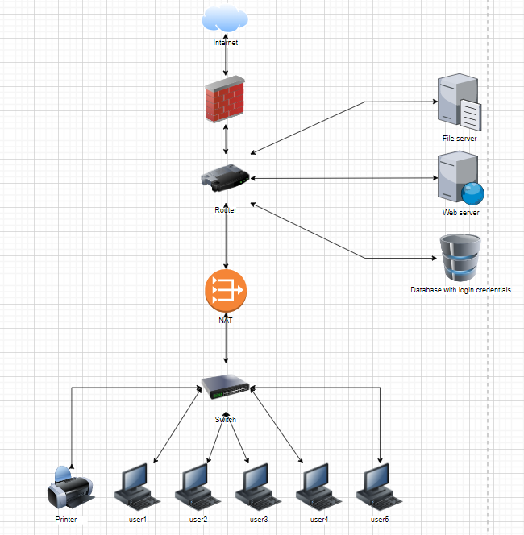

# Networking case study

Introduction
Case studies are a little different from the regular exercises you do here at Techgrounds. Up until now every exercise has introduced a new topic, where you had to figure out how to make it work. In a case study we combine your previously learned knowledge with a real life example (or a fictional example closely resembling a real life situation).

In this case study you take the role of a network administrator setting up a network in the new office of a small e-commerce company. Of course there are multiple ways to go about this problem, but this company has specifically said that network security is extremely important to them.
The office contains the following devices:
A web server where our webshop is hosted
A database with login credentials for users on the webshop
5 workstations for the office workers
A printer
An AD server
A file server containing internal documents

As a network administrator you get to choose which networking devices get used.

Requirements
https://app.diagrams.net/

Exercise
Design a network architecture for the above use case.
Explain your design decisions

## Key-terms
 Active Directory: (Wikipedia) a directory service developed by Microsoft for Windows domain networks. It is included in most Windows Server operating systems as a set of processes and services.[1][2] Initially, Active Directory was used only for centralized domain management. However, Active Directory eventually became an umbrella title for a broad range of directory-based identity-related services.[3]

A server running the Active Directory Domain Service (AD DS) role is called a domain controller. It authenticates and authorizes all users and computers in a Windows domain type network, assigning and enforcing security policies for all computers, and installing or updating software. For example, when a user logs into a computer that is part of a Windows domain, Active Directory checks the submitted username and password and determines whether the user is a system administrator or normal user.[4] Also, it allows management and storage of information, provides authentication and authorization mechanisms and establishes a framework to deploy other related services: Certificate Services, Active Directory Federation Services, Lightweight Directory Services, and Rights Management Services.

## Opdracht
### Gebruikte bronnen
https://en.wikipedia.org/wiki/Active_Directory

### Ervaren problemen
Het was even zoeken naar de betekenis en gebruik van de Active Directory Server of waar de AD server gepositioneerd moet worden in deze case study.

### Resultaat
Ik heb gekozen voor 2 subnets; 1 voor de servers en directories en 1 voor de office users met printer.
De AD directory heb ik centraal geplaats voor de databases en servers. De firewall plaatste ik voor de router en tussen het internet:

https://youtu.be/oopkClg1kxM

