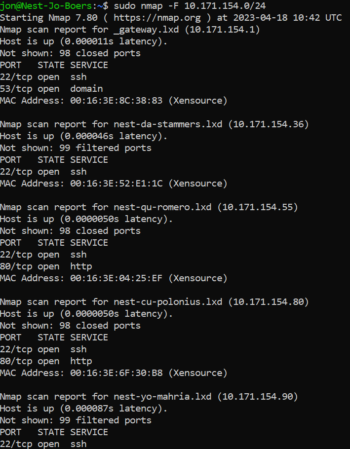
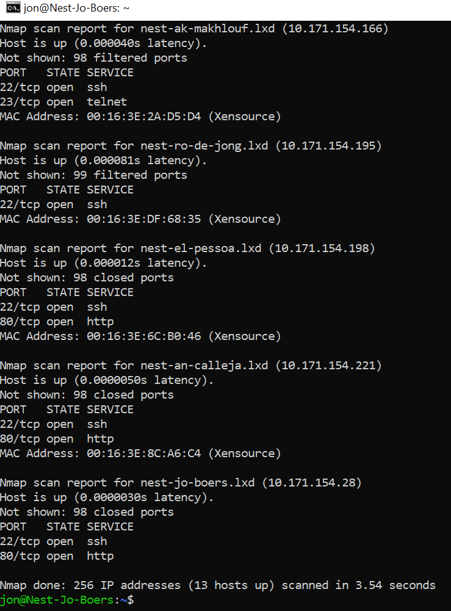
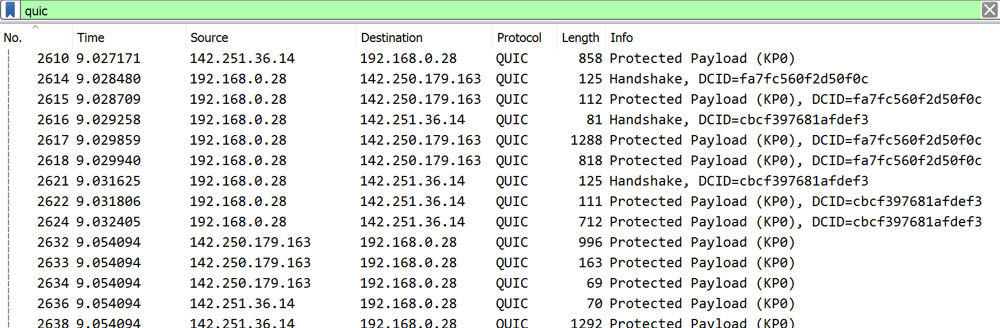

# Network detection

Introduction:
In order to prevent or stop attacks on a network, you must be able to analyse your network. There are many tools available to do this, but this exercise will focus on two very popular ones: nmap and Wireshark.

Nmap (Network Mapper) is a tool that scans a network to find information about it. For example, what ports are open in a host in your network.

Wireshark is a protocol analyzer. It looks at network traffic and shows information about packets like protocol and destination (among other things).

Requirements:
Your Linux machine
Wireshark

Study:
Scan the network of your Linux machine using nmap. What do you find?
Open Wireshark in Windows/MacOS Machine. Analyse what happens when you open an internet browser. (Tip: you will find that Zoom is constantly sending packets over the network. You can either turn off Zoom for a minute, or look for the packets sent by the browser between the packets sent by Zoom.)

## Key-terms

Nmap: (wiki)

Nmap (Network Mapper) is een opensource-netwerkscanner, oorspronkelijk geschreven door Gordon Lyon (ook bekend onder het pseudoniem Fyodor Vaskovich) en in september 1997 gepubliceerd in het magazine phrack.[2] Nmap werd initieel opgezet als een generieke port scanner voor het Linux-besturingssysteem maar heeft in de loop der jaren veel bijkomende functionaliteit en ondersteuning voor andere besturingssystemen gekregen.

Functionaliteit
De functionaliteit bestaat onder meer uit:

Host-discovery: het ontdekken van op een netwerk aanwezige hosts. Dit kan onder meer gebeuren door zogenoemde ping- of arpscans  
Port-scanning: het ontdekken welke poorten op een of meerdere doelcomputers luisteren.  
Versiedetectie: het door ondervraging van het doelsysteem ontdekken welke services inclusief de versie daarvan het systeem aanbiedt  
OS (besturingssysteem)-detectie: het bepalen welk besturingssysteem de doelcomputer gebruikt.  
Nmap Scripting Engine (NSE): een op Lua gebaseerd scriptingsysteem waarmee functionaliteit vrij eenvoudig uit te breiden is met bijvoorbeeld het testen op aanwezige kwetsbaarheden in het doelsysteem.  

Nmap wordt veelal gebruikt voor het inventariseren van computersystemen en netwerken en het testen van de beveiliging daarvan. Zoals veel computerbeveiligingsgereedschappen kan het door zowel beheerders van systemen als door kwaadwillenden gebruikt worden.

Quic protocol: (wiki)

QUIC (pronounced "quick") is a general-purpose transport layer network protocol initially designed by Jim Roskind at Google, implemented, and deployed in 2012, announced publicly in 2013 as experimentation broadened, and described at an IETF meeting. QUIC is used by more than half of all connections from the Chrome web browser to Google's servers. Microsoft Edge (a derivative of the open-source Chromium browser) and Firefox support it. Safari implements the protocol, however it is not enabled by default.

Although its name was initially proposed as the acronym for "Quick UDP Internet Connections", IETF's use of the word QUIC is not an acronym; it is simply the name of the protocol. QUIC improves performance of connection-oriented web applications that are currently using TCP. It does this by establishing a number of multiplexed connections between two endpoints using User Datagram Protocol (UDP), and is designed to obsolete TCP at the transport layer for many applications, thus earning the protocol the occasional nickname "TCP/2".

## Opdracht
### Gebruikte bronnen
https://nl.wikipedia.org/wiki/Nmap
https://nmap.org/download.html#linux-rpm
https://www.youtube.com/watch?v=YGotjq3gxis
https://www.comparitech.com/net-admin/decrypt-ssl-with-wireshark/#:~:text=Configure%20Wireshark%20to%20decrypt%20SSL&text=Open%20Wireshark%20and%20click%20Edit,)%2DMaster%2DSecret%20log%20filename.

### Ervaren problemen
Voor Wireshark was het lastig om te zien wat real-time gebeurde op het moment dat ik m'n browser opende en websites bezocht. Echter door een protocol filter 'Quic' te gebruiken kon ik wel de packets die gerelateerd waren onderscheiden. Ook zie ik dat er verschillende manieren zijn om de captures te analyseren en te filteren en zelfs decrypten. Er valt nog veel over te leren.

### Resultaat

Study:
Scan the network of your Linux machine using nmap. What do you find?

Eerst nmap geinstalleerd met de commands:

sudo apt-get update
sudo apt-get install nmap

Daarna het ip adres achterhaald met command;

ip addr

Waaruit bleek dat het ip adres 10.171.154.28 (/24) is.

Met het command:

sudo nmap -F 10.171.154.0/24 (waarbij -F staat voor Fast Scan)

Kreeg ik mijn klasgenoten te zien:

Met hun gebruikersnamen, IP-adressen, MAC adressen en welke poort ze gebruiken en of de poort openstaat. Ook wordt er melding gemaakt van overige poorten die of dicht staan (closed) of dat er niet bepaald kan worden of ze dicht of openstaan (filtered) 

**Open Wireshark in Windows/MacOS Machine. Analyse what happens when you open an internet browser. (Tip: you will find that Zoom is constantly sending packets over the network. You can either turn off Zoom for a minute, or look for the packets sent by the browser between the packets sent by Zoom.)**

Ik heb gefilterd op het 'Quic' protocol zodat realtime zichtbaar werd welke packets er gecaptured werden bij het openen van mijn chrome browser:

Zo zie ik dat er meerdere 'handshakes' worden gedaan om destination en source aan elkaar voor te stellen (TCP2 of Quic dus), dat er packets worden verzonden die encrypted zijn met als doel om de verbinding veilig en snel te houden. Ook zijn de IP-adressen van mijn host en de website zichtbaar. Er zijn filters, analyses en encrypties mogelijk om e.e.a. te ontcijferen en zichtbaar te maken. Een voorbeeld hiervan wordt omschreven in: https://www.youtube.com/watch?v=YGotjq3gxis.
