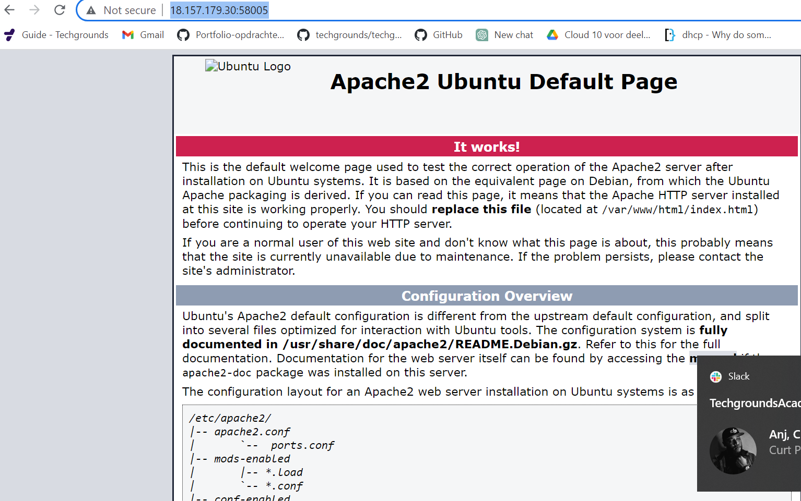
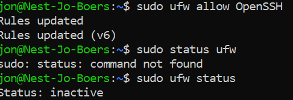
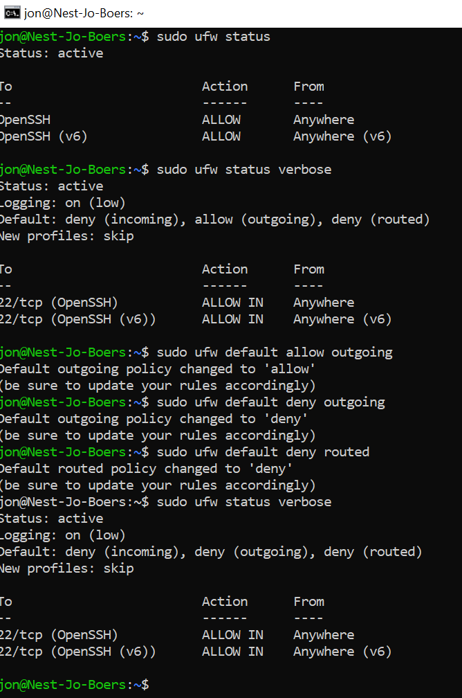

# Firewalls

Introductie:
Firewalls is software dat netwerkverkeer filtert. Een firewall kan dit verkeer filteren op protocol, poortnummer, bron en bestemming van een pakket. Meer geavanceerdere firewalls kunnen ook de inhoud inspecteren om eventuele gevaren te blokkeren.

CentOS en REHL hebben een standaard firewall daemon (firewalld) geïnstalleerd. Voor Ubuntu is de standaard firewall ufw. Een oudere nog veel voorkomende firewall in Linux is iptables.
 
Firewalls kunnen stateful of stateless zijn. Stateful firewalls onthouden de verschillende states van vertrouwde actieve sessies. Hierbij hoeft een stateful firewall niet elke pakketje te scannen voor deze verbindingen.

In een cloud omgeving zal je firewalls veel tegenkomen als een van de vele verdedigingslinies tegen het publieke internet. 

Bestudeer:
De verschillende types firewall
stateful / stateless
hardware / software

Benodigdheden:
Je Linux machine
Je unieke poortnummer voor http-verkeer

## Key-terms

**What is a Stateful Firewall?** A stateful firewall inspects everything inside data packets, the characteristics of the data, and its channels of communication. Stateful firewalls examine the behavior of data packets, and if anything seems off, they can filter out the suspicious data. Also, a stateful firewall can track how the data behaves, cataloging patterns of behavior. 

If a data packet examination reveals suspicious behavior—even if that kind of behavior has not been manually inputted by an administrator—the firewall can recognize it and address the threat. A stateful firewall can be used at the edge of a network or within, as is the case with an internal segmentation firewall (ISFW), which protects specific segments of the network in the event malicious code gets inside.

**What is a Stateless Firewall?**
Stateless firewalls make use of a data packet's source, destination, and other parameters to figure out whether the data presents a threat. These parameters have to be entered by either an administrator or the manufacturer via rules they set beforehand. 

If a data packet goes outside the parameters of what is considered acceptable, the stateless firewall protocol will identify the threat and then restrict or block the data housing it.

**Software vs Hardware Firewalls**
Hardware firewalls are not the only available firewall option. An organization may choose to deploy a software-based firewall as well.

The main difference between a hardware firewall and a software firewall is that the hardware firewall runs on its own physical device, while a software firewall is installed on another machine. A common example of a software firewall is the firewall built into most operating systems like Windows and macOS. These OS firewalls are bundled with the operating system and can run on any compatible hardware.

However, these OS firewalls are not the only options for software firewalls. Like hardware firewalls, software firewalls are also offered as standalone solutions. An organization can purchase and deploy these firewalls in locations where a hardware firewall may not be a viable option, such as in cloud environments.

Key Benefits of Hardware Firewalls:  
Hardware firewalls, deployed as physical appliances, provide a number of benefits compared to software firewalls, including:

*Consistent Security:* Software firewalls installed on different computers can all be configured differently. Unless an organization can implement and enforce a consistent security configuration, software firewalls may be disabled or have varying levels of security. A hardware firewall, on the other hand, provides consistent protection to all devices protected by it.  
*Standalone Protection:* A software firewall likely runs on the protected computer. This means that it takes up resources that could otherwise be used for other purposes. A hardware firewall runs on its own hardware, meaning that increases in traffic volume or security requirements do not impact the performance of the protected machines.  
*Simplified Management:* With a software firewall, each computer needs to be individually configured, managed, and updated to provide strong protection against cyber threats. A hardware firewall, on the other hand, is a single appliance that protects the entire network. Any updates or configuration changes that are required can be applied once and will instantly apply to all devices protected by the firewall.
*Improved Security:* A hardware firewall runs on its own dedicated hardware instead of relying on the resources of the computer where it is installed. This can help to protect it against attacks designed to exploit the underlying operating system or the programs running alongside it.
*Centralized Visibility:* Running independent software firewalls on each device within an organization’s network means that the security team either lacks complete network visibility or must put in extra effort to aggregate and assimilate information from all of the various devices. A hardware firewall centralizes all network monitoring and logging in a single appliance.

## Opdracht
### Gebruikte bronnen
https://www.fortinet.com/resources/cyberglossary/stateful-vs-stateless-firewall  
https://www.geeksforgeeks.org/difference-between-hardware-and-software/  
https://www.checkpoint.com/cyber-hub/network-security/what-is-firewall/what-is-a-hardware-firewall/#:~:text=The%20main%20difference%20between%20a,systems%20like%20Windows%20and%20macOS
https://www.linuxcapable.com/upgrade-apache-on-ubuntu-linux/
https://www.cyberciti.biz/faq/how-to-configure-firewall-with-ufw-on-ubuntu-20-04-lts/#Turn_on_ufw_firewall

https://www.youtube.com/watch?v=5juUB09V9E8  

https://www.youtube.com/watch?v=aUPoA3MSajU

https://www.youtube.com/watch?v=rL4-vbsN35w

Mijn team

### Ervaren problemen

Ubuntu en apache 2 geupdate, daarna moest ik de poort  (58005) nog veranderen met:

sudo nano /etc/apache2/ports.conf

Bleek dat ik al die tijd ook nog een typefout had gemaakt met het ip-adres.

### Resultaat

Opdracht:

**Installeer een webserver op je VM.**

Ubuntu en Apache geupdate. 

**Bekijk de standaardpagina die met de webserver geïnstalleerd is.**

**Stel de firewall zo in dat je webverkeer blokkeert, maar wel ssh-verkeer toelaat.**

Eerst mijn SSH geauthoriseerd met:

sudo ufw allow OpenSSH

Controleer of de firewall zijn werk doet.

sudo ufw status verbose: om de status te checken
sudo ufw enable/disable: Firewall aan/uit
sudo ufw allow openSSH

Vervolgens was de standaard website niet meer bereikbaar in mijn browser.