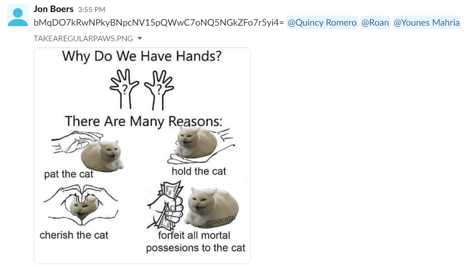
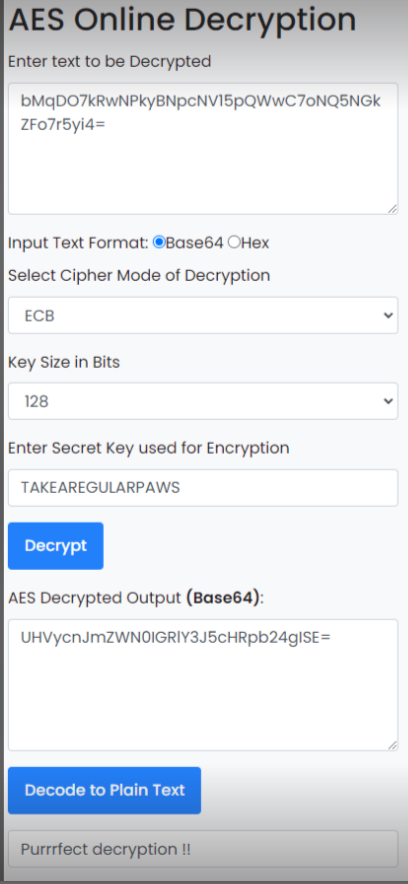
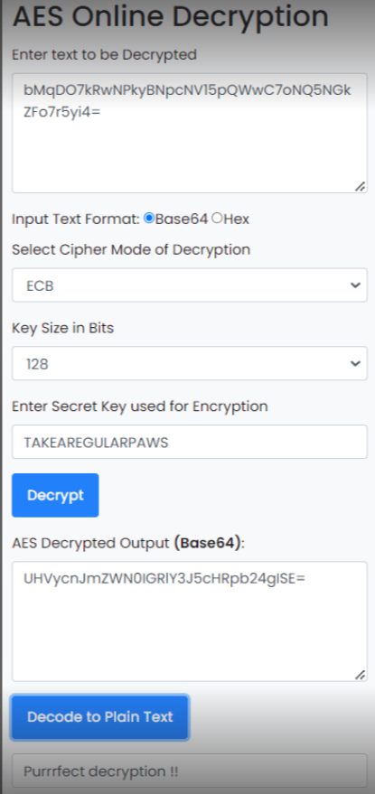

# Symmetric encryption

Introduction:
Encryption is an important tool for securing data. Be it data at rest, or data in motion. A lot of what you do on your computer and the Internet is encrypted.

Throughout history humanity has come up with many ciphers to encode information. Most of these are symmetric ciphers, the most famous one being the Caesar cipher.

In this assignment you will learn about the basics of cryptography, starting with symmetrical encryption.

Requirements:
The Slack channel your share with your entire cohort
A peer

## Key-terms

*Caesar cipher*: In cryptography, a Caesar cipher, also known as Caesar's cipher, the shift cipher, Caesar's code or Caesar shift, is one of the simplest and most widely known encryption techniques. It is a type of substitution cipher in which each letter in the plaintext is replaced by a letter some fixed number of positions down the alphabet. For example, with a left shift of 3, D would be replaced by A, E would become B, and so on. The method is named after Julius Caesar, who used it in his private correspondence.

The encryption step performed by a Caesar cipher is often incorporated as part of more complex schemes, such as the Vigenère cipher, and still has modern application in the ROT13 system. As with all single-alphabet substitution ciphers, the Caesar cipher is easily broken and in modern practice offers essentially no communications security.

*Enigma Code* The term 'Enigma Code' is generally understood as the cipher device used by German forces during WW2 to encrypt their transmissions.

*AES & (triple) DES* : see below

## Opdracht
### Gebruikte bronnen

Wikipedia
https://interestingengineering.com/innovation/11-cryptographic-methods-that-marked-history-from-the-caesar-cipher-to-enigma-code-and-beyond  
https://www.simplilearn.com/data-encryption-methods-article
https://www.javainuse.com/aesgenerator  
https://www.devglan.com/online-tools/aes-encryption-decryption

### Ervaren problemen

### Resultaat

Exercise:

**Find one more historic cipher besides the Caesar cipher.**

The term 'Enigma Code' is generally understood as the cipher device used by German forces during WW2 to encrypt their transmissions.

Enigma machines were invented by the Germans towards the end of the First World War and were then adopted by various militaries around the world. 

During the Second World War, different military services developed their own encryption keys that would often be changed daily. As the allies cracked the codes the Axis forces would be forced to change them - only to have them cracked again.

A primary example of this 'code arms race' was the different phases of the success of German U-Boat 'Wolf Packs' during the Battle for the Atlantic.

**Find two digital ciphers that are being used today.**

*AES.* The Advanced Encryption Standard (AES) is the trusted standard algorithm used by the United States government, as well as other organizations. Although extremely efficient in the 128-bit form, AES also uses 192- and 256-bit keys for very demanding encryption purposes. AES is widely considered invulnerable to all attacks except for brute force. Regardless, many internet security experts believe AES will eventually be regarded as the go-to standard for encrypting data in the private sector.

*Triple DES.* Triple DES is the successor to the original Data Encryption Standard (DES) algorithm, created in response to hackers who figured out how to breach DES. It’s symmetric encryption that was once the most widely used symmetric algorithm in the industry, though it’s being gradually phased out. TripleDES applies the DES algorithm three times to every data block and is commonly used to encrypt UNIX passwords and ATM PINs.

**Send a symmetrically encrypted message to one of your peers via the public Slack channel. They should be able to decrypt the message using a key you share with them. Try to think of a way to share this encryption key without revealing it to everyone. You are not allowed to use any private messages or other communication channels besides the public Slack channel. Analyse the shortcomings of symmetric encryption for sending messages.**

Het was iets te makkelijk te ontcijferen en ik had het mensen moeilijker kunnen maken, maar uiteindelijk zou het worden gekraakt omdat boodschap en sleutel beide public verkrijgbaar zijn, maar leuk was het wel:
Quincy:
  
Younes:
