# Public Key Infrastructure

Introduction:
Public Key Infrastructure (PKI) is a set of roles, policies, hardware, software and procedures needed to create, manage, distribute, use, store and revoke digital certificates and manage public-key encryption.
It consists of three entities that assure you can communicate securely over an insecure network like the public internet.

X.509 is the standard which defines the process in which a PKI should function. There are many ways of implementing a PKI, not all of them comply with the X.509 standard.

Requirements:
Your Linux machine
An internet browser

## Key-terms

SSL: Secure Sockets Layer, is an encryption-based Internet security protocol. It was first developed by Netscape in 1995 for the purpose of ensuring privacy, authentication, and data integrity in Internet communications. SSL is the predecessor to the modern TLS encryption used today. A website that implements SSL/TLS has "HTTPS" in its URL instead of "HTTP."

CSR: Certificate Signing Request. A CSR contains details about location, organization, and FQDN (Fully Qualified Domain Name)

CA: Certificate Authority (ex. Verisign, Comodo)

openssl: invokes the OpenSSL command-line tool.
req: specifies that the command is for certificate requests.
-x509: specifies that the command is for self-signed X.509 certificates.  
-sha256: specifies that the certificate should use the SHA-256 hash function for signature.  
-days 356: specifies the validity period of the certificate in days (one year in this case).  
-nodes: specifies that the generated private key should not be encrypted with a password.  
-newkey rsa:2048: specifies that the key should be generated using RSA with a key size of 2048 bits.  
-subj "/CN=opdracht.sec06.com/C=NL/L=Eindhoven": specifies the subject information for the certificate, including the common name (CN), country (C), and locality (L).  
-keyout rootCA.key: specifies the file name to save the generated private key to.  
-out rootCA.crt: specifies the file name to save the generated certificate to.  

-genrsa: specifies that the command is for generating an RSA private key.  
-out server.key: specifies the file name to save the generated private key to.  
-2048: specifies the key size, which is the number of bits in the key. In this case, the key size is set to 2048 bits.  
*When you run this command, OpenSSL generates a new private key for the server and saves it to the specified file, server.key. This private key can be used in combination with a public key (e.g., a certificate) to enable secure communication with the server using protocols like HTTPS or SSH.*

certification path: A chain of trusted public-key certificates that begins with a certificate whose signature can be verified by a relying party using a trust anchor, and ends with the certificate of the entity whose trust needs to be established.

## Opdracht
### Gebruikte bronnen

https://devopscube.com/create-self-signed-certificates-openssl/
https://documentation.observeit.com/installation_guide/  finding_the_path_to_the_trusted_certificates.htm

### Ervaren problemen

### Resultaat
**Exercise:**
**Create a self-signed certificate on your VM.**

Create Certificate Authority:

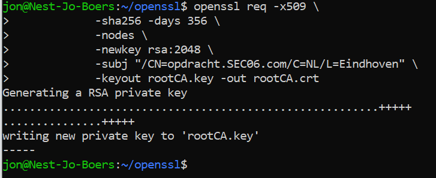

Create server private key:

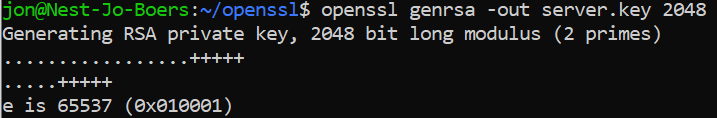

Create Certificate Signing Request Configuration:

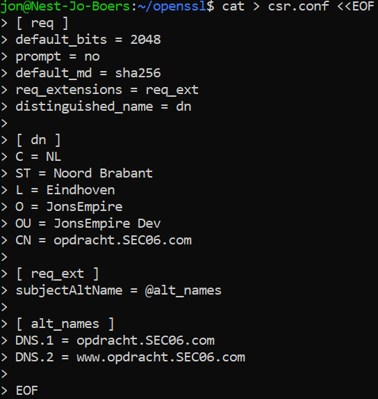

Generating Certificate Signing Request (CSR) Using Server Private Key:

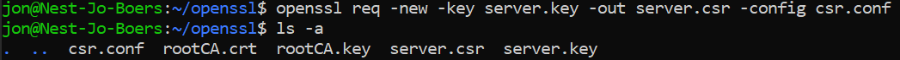

Create a external file:

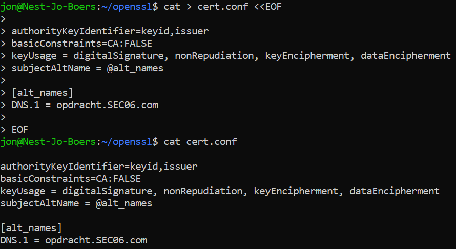

Generate SSL certificate With self signed CA:

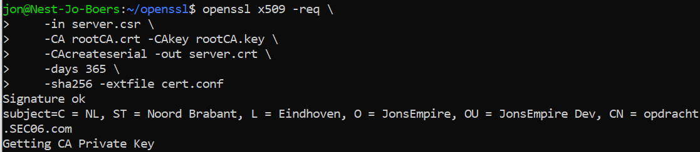

Certificate:

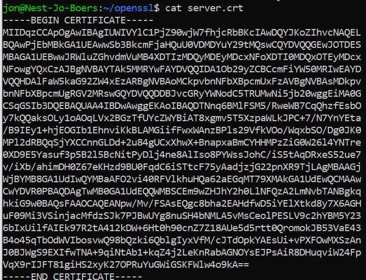

**Analyze some certification paths of known websites (ex. techgrounds.nl / google.com / ing.nl).**

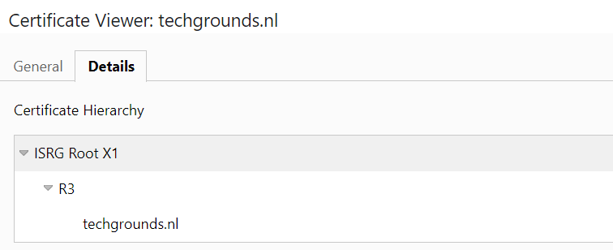
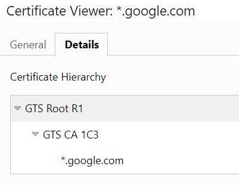
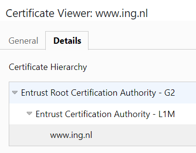

**Find the list of trusted certificate roots on your system (bonus points if you also find it in your VM).**

Door dit in te voeren in de zoekbalk in het start menu: " certmgr.msc " 

Kreeg ik de volgende lijst te zien:

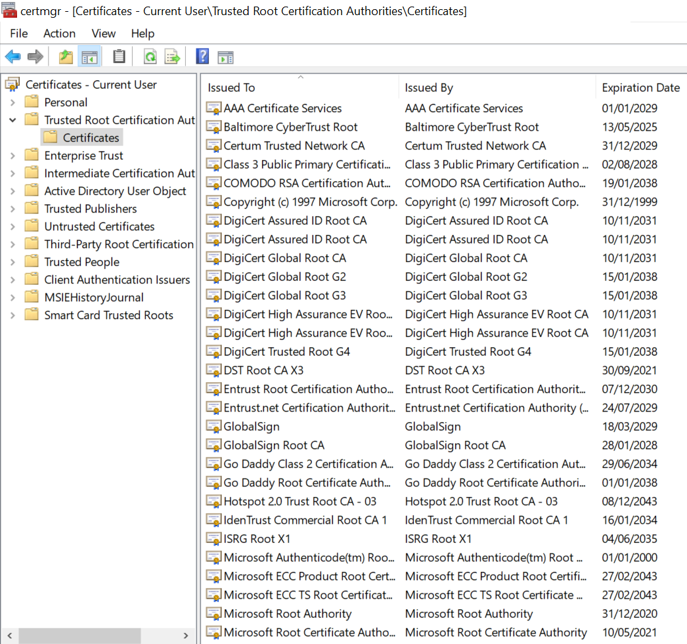

VM:

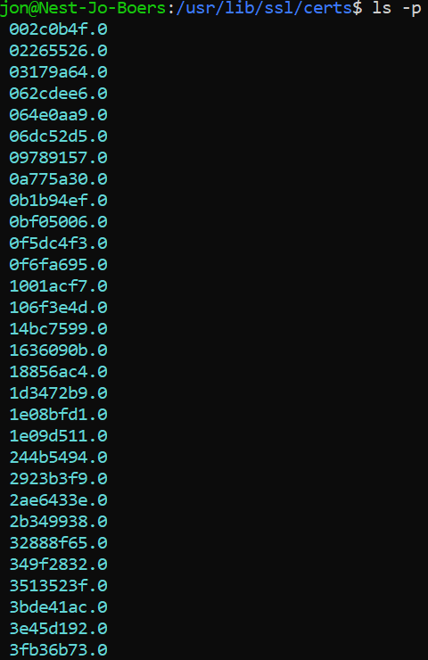

