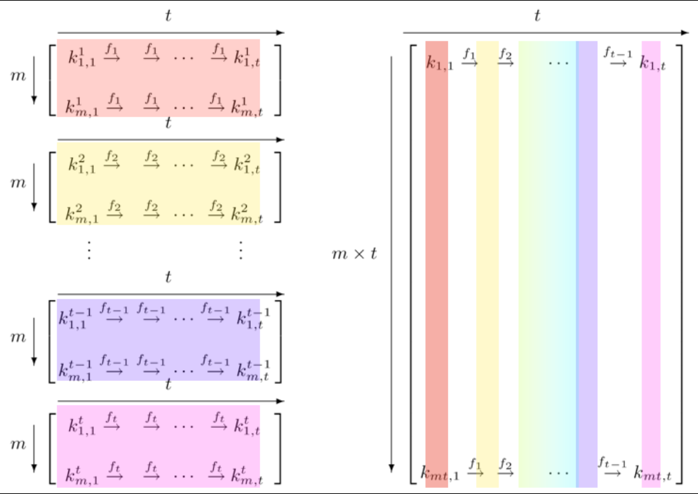

# Passwords

Introduction:
In terms of factors of authentication, passwords fall into the ‘something you know’ category.
On the front-end, passwords can be guessed. This can be made harder with the following strategies:
Not using common passwords
Using longer passwords
Using special characters like @,*,%, etc.
Using a mixture of CAPITAL and small letters
Not using easily deducible passwords like birthdates or pet names
Using a different password for every login
Using a passphrase

Of course, these strategies make it harder to remember your own passwords. Password managers were created to solve this problem.
On the back-end, passwords need to be stored securely. If your database (or /etc/shadow file in Linux) gets leaked or stolen, you don’t want anyone to just be able to read passwords in plaintext. This is why most stored passwords are hashed. Hackers will try to use a Rainbow Table to crack hashed passwords.

Requirements:
Your Linux machine
A peer
An online Rainbow Table like https://crackstation.net/

## Key-terms

Hashing: the process of converting a given key into another value. A hash function is used to generate the new value according to a mathematical algorithm. The result of a hash function is known as a hash value or simply, a hash.

Salt: random data that is used as an additional input to a one-way function that hashes data, a password or passphrase. Salts are used to safeguard passwords in storage. Historically, only the output from an invocation of a cryptographic hash function on the password was stored on a system, but, over time, additional safeguards were developed to protect against duplicate or common passwords being identifiable (as their hashes are identical). Salting is one such protection.

key derivation function (KDF): is a cryptographic algorithm that derives one or more secret keys from a secret value such as a master key, a password, or a passphrase using a pseudorandom function (which typically uses a cryptographic hash function or block cipher). KDFs can be used to stretch keys into longer keys or to obtain keys of a required format, such as converting a group element that is the result of a Diffie–Hellman key exchange into a symmetric key for use with AES. Keyed cryptographic hash functions are popular examples of pseudorandom functions used for key derivation.

## Opdracht
### Gebruikte bronnen

https://www.educative.io/answers/what-is-hashing  
https://nordlocker.com/blog/hashing-vs-encryption/#:~:text=Encryption%20works%20both%20ways%2C%20while,while%20hashing%20protects%20its%20integrity  
https://en.wikipedia.org/wiki/Rainbow_table  
https://en.wikipedia.org/wiki/Salt_(cryptography)  

### Ervaren problemen

### Resultaat

Exercise:

**Find out what hashing is and why it is preferred over symmetric encryption for storing passwords.**

Encryption works both ways, while hashing is a one-way function. Hashing boils down the original to a fixed set of characters. This is not the case with encrypted messages. Encryption secures data, while hashing protects its integrity.

**Find out how a Rainbow Table can be used to crack hashed passwords.**

Rainbow tables calculate the hash function of every string placed in the table. A rainbow table is constructed using chains of both hashing and reduction functions. Common plaintext passwords are repeatedly passed through a chain of these operations and then stored in the table next to their corresponding hash.

The term rainbow tables was first used in Oechslin's initial paper. The term refers to the way different reduction functions are used to increase the success rate of the attack. The original method by Hellman uses many small tables with a different reduction function each. Rainbow tables are much bigger and use a different reduction function in each column. When colors are used to represent the reduction functions, a rainbow appears in the rainbow table. Figure 2 of Oechslin's paper contains a black-and-white graphic that illustrates how these sections are related. For his presentation at the Crypto 2003 conference, Oechslin added color to the graphic in order to make the rainbow association more clear.

**Below are two MD5 password hashes. One is a weak password, the other is a string of 16 randomly generated** **characters. Try to look up both hashes in a Rainbow Table.**
**03F6D7D1D9AAE7160C05F71CE485AD31**
**03D086C9B98F90D628F2D1BD84CFA6CA**

Create a new user in Linux with the password 12345. Look up the hash in a Rainbow Table.
Despite the bad password, and the fact that Linux uses common hashing algorithms, you won’t get a match in the Rainbow Table. This is because the password is salted. To understand how salting works, find a peer who has the same password in /etc/shadow, and compare hashes.

