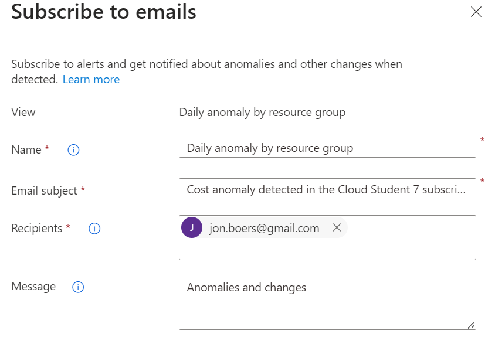
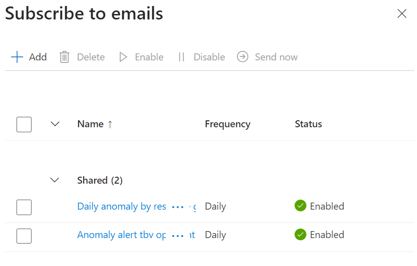

# Cost Management + Billing

Introductie:
Een veelgenoemd voordeel van de cloud is dat je alleen betaalt voor wat je gebruikt. Het gaat hier om OPEX in plaats van CAPEX uitgaven. De “Cost Management + Billing” tool geeft inzicht in je uitgaven in Azure en stelt je in staat je subscriptions te beheren.

Wanneer je een ‘Free Account’ of een ‘Student Account’ aanmaakt krijg je een bedrag van Microsoft cadeau om in Azure mee te experimenteren. Houd er rekening mee dat na 30 dagen je subscription automatisch stop wordt gezet, waardoor al je nog draaiende diensten uitgezet worden.

Als je een ‘Pay-as-you-go’ subscription heb aangemaakt zijn er een aantal diensten die tot op zekere hoogte altijd gratis zijn. Begrijp wel dat deze diensten soms geïntegreerd zijn met andere diensten waar je wel voor moet betalen. 

Azure heeft de volgende principes om succesvol je kosten te reduceren:  
Plan (Planning)  
Zichtbaarheid (Visibility)  
Verantwoording (Accountability)  
Optimalisatie (Optimization)  
Iteratie (Iteration)  

De Total Cost of Ownership (TCO) wordt gebruikt om te berekenen hoeveel een infrastructuur kost als het op de traditionele manier gehost wordt. Met de TCO-calculator kan je de kosten van een traditionele infrastructuur vergelijken met de kosten voor dezelfde infrastructuur op Azure.

Benodigdheden:
Je Azure Cloud omgeving (link)
Azure documentatie

Bestudeer:
De Azure principes voor kostenmanagement
De voorwaarden van de ‘Free subscription’
Het verschil tussen CAPEX en OPEX.
De TCO-calculator

## Key-terms

Opex: OPerational EXpenditures of operationele uitgaven. Het zijn uitgaven die het gevolg zijn van het exploiteren van eerder aangeschafte kapitaalgoederen

Capex: CAPital EXpenditures of kapitaaluitgaven. Het zijn  investeringsuitgaven in vaste activa als gevolg van vervanging en/of uitbreiding 

(Capex zijn eenmalige uitgaven en Opex zijn terugkerende uitgaven)

TCO: Total Cost of Ownership

## Opdracht

Met *Microsoft cost management* kan je de kosten en efficientie van de cloudinvesteringen in de gaten houden. De principes zijn samen te vatten in de termen; zichtbaarheid, verantwoordelijkheid en optimalisatie. Met de kostenanalyse krijg je toegang tot operationele en financiele inzichten. Door het maken van budgetten en kostentoewijzingen kan je verantwoordingsplicht creeren in de organisatie. Daarnaast kan je het rendement op je cloudinvestering verbeteren door gebruik te maken van continue kostenoptimalisatie. De cost management tool vormt zo een dashboard waarmee de clouduitgaven beheerst kunnen worden. Een goede cloudbeveiliging is daarnaast essentieel om grote kosten door schade in de toekomst zo veel mogelijk te voorkomen.

De voorwaarden van de ‘Free subscription’: https://azure.microsoft.com/nl-nl/pricing/offers/ms-azr-0044p/  

Met de TCO-calculator kan je uitrekenen wat de totale kosten zullen worden na migratie of implementatie van je cloudomgeving. Dit is een schatting van de werkelijke kosten, maar geven inzicht in je toekomstige uitgaven na het invoeren van je 'workload'. (servers, databases, storage, networking bandwith and region) Ook kunnen er parameters zoals 'assurance', GRS (geo redundant storage) en virtual machine costs worden ingegeven. Uiteindelijk komt er een report uit met een termijn van 1-5 jaar. https://azure.microsoft.com/en-in/pricing/tco/calculator/  

### Gebruikte bronnen
https://cmweb.nl/2022/11/wat-zijn-capex-en-opex/#:~:text=Opex%20is%20ook%20een%20letterwoord,en%20Opex%20zijn%20terugkerende%20uitgaven  
https://azure.microsoft.com/nl-nl/products/cost-management#overview  
https://azure.microsoft.com/nl-nl/free/free-account-faq/  
https://azure.microsoft.com/nl-nl/pricing/offers/ms-azr-0044p/  
https://azure.microsoft.com/en-in/pricing/tco/#:~:text=The%20TCO%20Calculator%20helps%20you,software%20licenses%2C%20electricity%20and%20labor  
https://azure.microsoft.com/en-in/pricing/tco/calculator/  

### Ervaren problemen

Zat een tijdje vast in een authenticator loop, maar na het deinstalleren en opnieuw installeren van de app ging het authenticaten goed.

### Resultaat

**Opdracht:**  

**Maak een alert aan waarmee je eigen kosten kan monitoren.**
**Begrijp de opties die Azure aanbiedt om je uitgaven in te zien.**

Zowel een budget alert als een anomaly alert aangemaakt:

