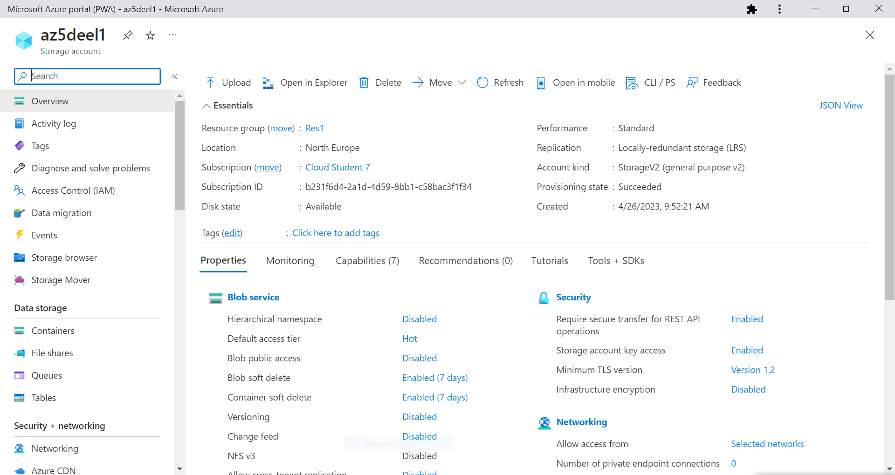
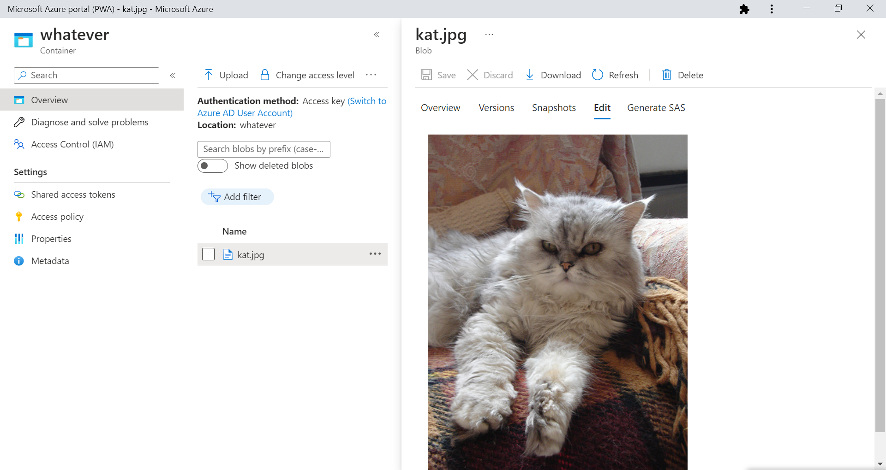
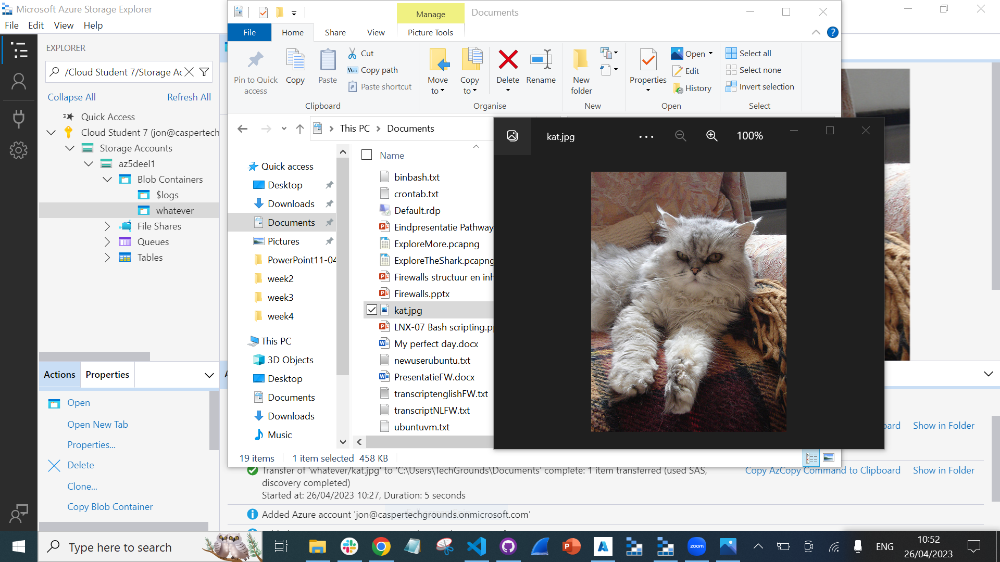
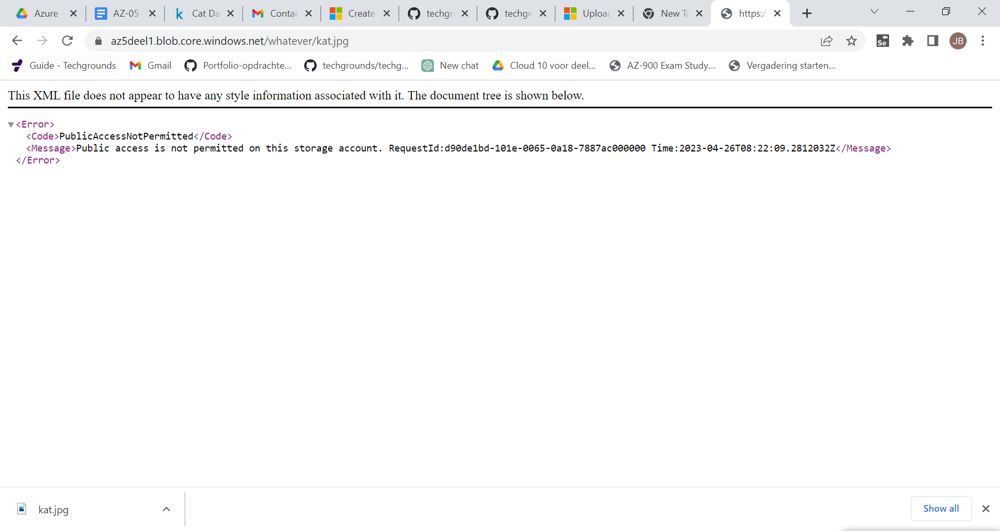
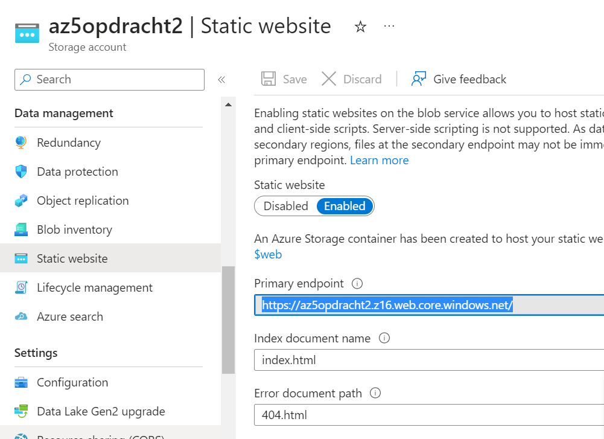
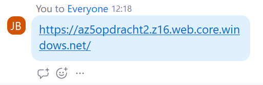
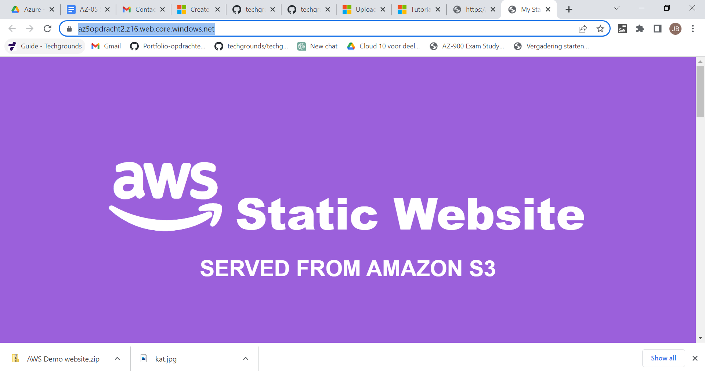

# Azure Storage Account

Introductie:
Om data op te slaan in Azure heb je een Azure Storage Account nodig. In een Storage Account staan alle Azure Storage data objects als blobs, files, disks en tables.

Data in een Storage Account is secure, highly available, durable en massively scalable. Alle data in een Storage Account is bereikbaar via het internet met HTTP en HTTPS. Omdat het makkelijk te bereiken is moet je goed opletten dat alleen de juiste identiteiten permissies hebben om bij de data te komen.

Azure Storage explorer is een gratis GUI om je data te beheren in Azure.

Veel IaaS en PaaS services van Azure maken ook gebruik van Azure Storage Accounts.

Naast het opslaan van data kan Blob Storage ook gebruikt worden voor het hosten van statische websites.

Benodigdheden:
Je Azure Cloud omgeving (link)
Azure Storage Explorer

## Key-terms
[Schrijf hier een lijst met belangrijke termen met eventueel een korte uitleg.]

## Opdracht

**Opdracht 1:**

Maak een Azure Storage Account. 
 Zorg dat alleen jij toegang hebt tot de data.
Plaats data in een storage service naar keuze via de console (bijvoorbeeld een kattenfoto in Blob storage).  
  

Haal de data op naar je eigen computer door middel van de Azure Storage Explorer.

**Opdracht 2:**

Maak een nieuwe container aan.
Upload de 4 bestanden die samen de AWS Demo Website vormen.
Zorg dat Static Website Hosting aan staat.
Deel de URL met een teamgenoot. Zorg ervoor dat zij de website kunnen zien.

### Gebruikte bronnen
https://learn.microsoft.com/en-us/azure/storage/blobs/storage-blob-static-website-host

### Ervaren problemen

Bij opdracht1 stonden mijn firewall setting verkeerd en werd mijn ip address niet toegestaan.

Bij opdracht2 bleef ik volharden met het proberen van de 'local' link, terwijl de endpoint link gevolgd had moeten worden. Veel te veel tijd mee verspild terwijl de opdracht al lang klaar was.

### Resultaat
zie boven.
