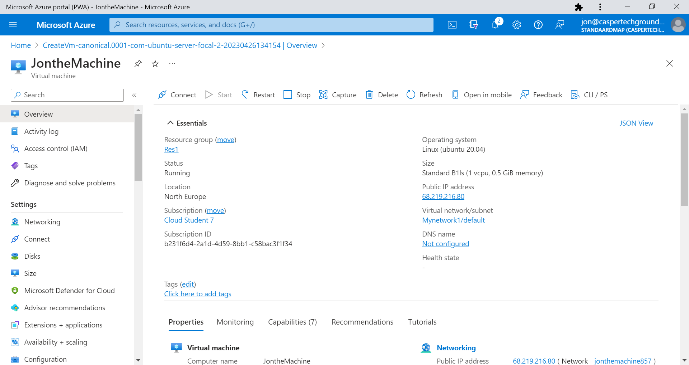
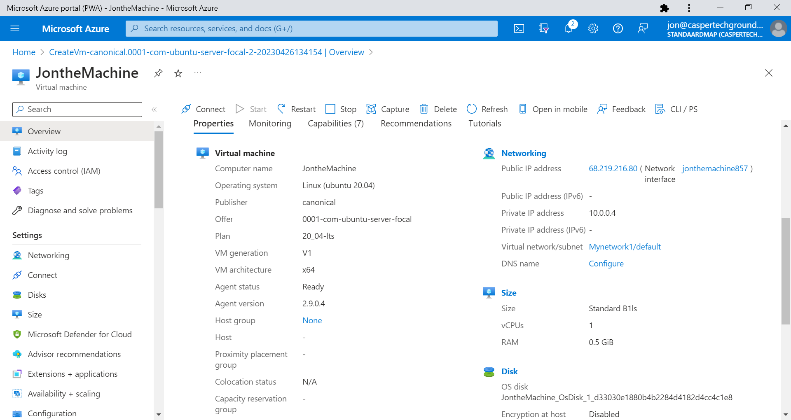
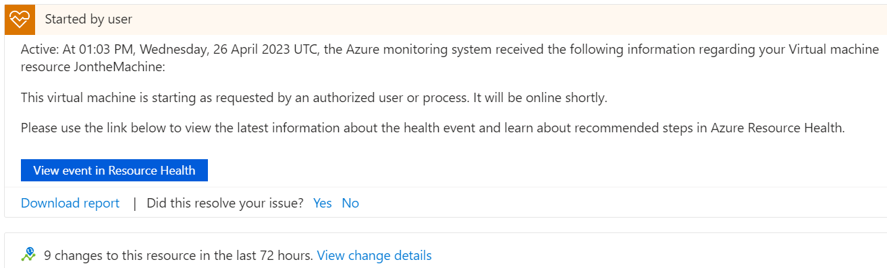
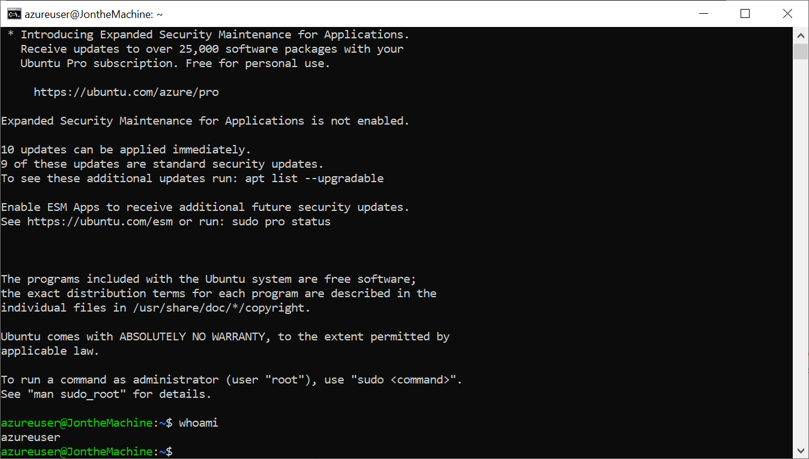
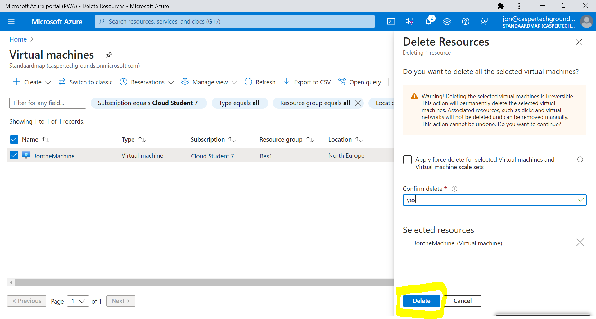

# Azure Virtual Machines

Introductie:
De Service waarmee je VMs kan maken in Azure heet (zeer toepasselijk) Azure Virtual Machines. Je kan deze VMs gebruiken voor alles waar je een fysieke server voor zou gebruiken. Omdat ze in een datacenter van Microsoft staan, kan je er alleen verbinding mee maken via het internet. Verbinding met een remote Linux-machine maak je met het Secure Shell (ssh) protocol. Voor een verbinding met Windows machines gebruik je het Remote Desktop Protocol (RDP).

Om een VM aan te maken moet je een image selecteren. Een image is een soort blauwdruk voor je machine. Het bevat onder andere een template voor het OS.

VMs komen in verschillende sizes. Elke size heeft een andere hoeveelheid vCPUs, RAM, Data disks, Max IOPS, Temp storage, Premium disk support en prijs.

Voor de OS disk (de root volume) kan je kiezen uit Premium SSD, Standard SSD en Standard HDD. Je hebt ook de optie om extra Data disks toe te voegen.

Je kan optioneel je VM beveiligen met een NIC network security group. Het wordt aangeraden om network security groups te configureren op subnet niveau (en dus niet op instance niveau) waar mogelijk, maar soms heb je een allow/deny rule nodig op een specifieke instance, dus de optie is er. In elk geval kan je firewalls dus buiten de instance regelen, en hoef je niet binnen de VM nog een extra firewall te configureren.

Met Custom Data kan je een cloud-init script, config file of andere data meegeven tijdens het opstarten van de VM. Hiermee kan je automatisch servers configureren zonder zelf in te loggen.
User data is een nieuwe versie van Custom data. Het grootste verschil is dat user data beschikbaar blijft gedurende de hele levensduur van de VM.


De prijs van een Azure VM hangt af van de size, de image, de regio waar hij in staat, het aantal minuten dat hij aan staat, en het type betaling dat je doet.  

* Pay-as-you-go is de duurste optie, maar ook het meest flexibel.  
* Reserved Instances zijn goedkoper, maar je zit vast aan een reservatie van 1 of 3 jaar. 
* Spot instances zijn over het algemeen het goedkoopst, maar de availability hangt af van de vraag naar VMs op dat moment, dus ze zijn niet altijd betrouwbaar.

Benodigdheden:
Je Azure-cloud omgeving


## Key-terms
IOPS: Input/Output Operations per Second  
https://azure.microsoft.com/nl-nl/blog/virtual-machines-best-practices-single-vms-temporary-storage-and-uploaded-disks/

## Opdracht

Opdracht:  
* Log in bij je Azure Console.
* Maak een VM met de volgende vereisten:
    * Ubuntu Server 20.04 LTS - Gen1
    * Size: Standard_B1ls
    * Allowed inbound ports:
        * HTTP (80)
        * SSH (22)
    * OS Disk type: Standard SSD
    * Networking: defaults
    * Boot diagnostics zijn niet nodig
    * Custom data: 

```
#!/bin/bash    
sudo su   
apt update   
apt install apache2 -y   
ufw allow 'Apache '  
systemctl enable apache2   
systemctl restart apache2  
```
* 
    * Controleer of je server werkt.  
    * Let op! Vergeet na de opdracht niet alles weer weg te gooien. Je kan elk onderdeel individueel verwijderen, of je kan in 1 keer de resource group verwijderen.

### Gebruikte bronnen
https://www.techtarget.com/searchstorage/definition/IOPS-input-output-operations-per-second

### Ervaren problemen
### Resultaat




Nog even ingelogd:


En weer weggegooid:
