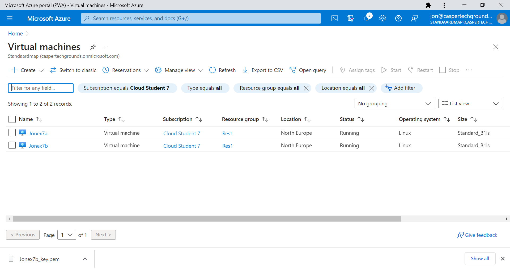
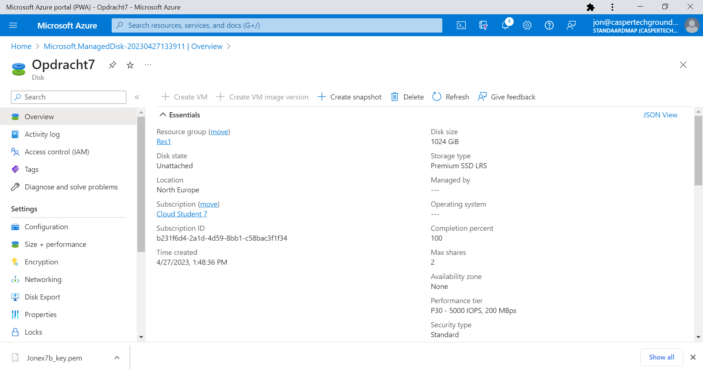
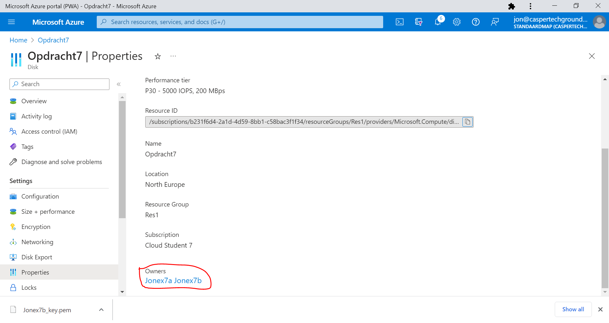

# Azure Disk Storage

Introductie:
Azure Disk Storage kan gezien worden als een virtual hard drive in de cloud. Een disk kan een OS disk (waar het OS op staat) of een Data Disk (te vergelijken met een externe harde schijf) zijn. Je hebt een keuze tussen Managed Disks en Unmanaged Disks. Unmanaged Disks zijn goedkoper, maar je hebt er wel een Storage Account nodig (en je moet de disk dus zelf managen). Managed Data Disks kunnen gedeeld worden tussen meerdere VMs, maar dat is een relatief nieuwe feature en er zitten wat haken en ogen aan.

Backups van een Managed Disk kan je maken met Incremental Snapshots die alleen de aanpassingen sinds de laatste snapshot opslaan. Voor een Unmanaged Disk kan je alleen een ‘normale’ snapshot maken.

Er zijn 4 typen managed disks. Over het algemeen kan je zeggen dat meer performance zorgt voor hogere kosten:  
bron: https://docs.microsoft.com/en-us/azure/virtual-machines/disks-types  
| Detail         | Ultra Disk                                                                                                                    | Premium SSD                                    | Standard SSD                                                   | Standard HDD                            |
| -------------- | ----------------------------------------------------------------------------------------------------------------------------- | ---------------------------------------------- | -------------------------------------------------------------- | --------------------------------------- |
| Disk Type      | SSD                                                                                                                           | SSD                                            | SSD                                                            | HDD                                     |
| Scenario       | IO-intensive workloads, such as SAP HANA, top tier databases (for example, SQL Oracle), and other transaction-heavy workloads | Production and performance sensitive workloads | Web servers, lightly used enterprise applications and dev/test | Backup, non-critical, infrequent access |
| Max disk size  | 65 536 GiB                                                                                                                    | 32 767 GiB                                     | 32 767 GiB                                                     | 32 767 GiB                              |
| Max throughput | 2000 MB/s                                                                                                                     | 900 MB/s                                       | 750 MB/s                                                       | 500 MB/s                                |
| Max IOPS       | 160 000                                                                                                                       | 20 000                                         | 6000                                                           | 2000                                    |

Een disk kan ge-encrypt worden voor security. Disks kunnen groter worden, maar niet kleiner.
Als je een external device (inclusief een Data Disk) wilt gebruiken op Linux, moet je hem eerst mounten.

Benodigdheden:
Je Azure Cloud omgeving (link)

## Key-terms
* Azure managed disks: opslagvolumes op blokniveau die worden beheerd door Azure en worden gebruikt met Azure Virtual Machines. Managed disks zijn als een fysieke schijf op een on-premises server, maar zijn gevirtualiseerd. Met managed disks hoeft alleen de schijfgrootte en het schijftype op te worden gegeven en de schijf ingericht te worden. Zodra de schijf is ingericht, verwerkt Azure de rest.De beschikbare typen schijven zijn ultraschijven, premium SSD's (solid-state drives), standard SSD's en standaard hardeschijfstations (HDD).
* Block-level storage
* lsblk: lists all blockdevices
* partprobe: is a program that informs the operating system kernel of partition table changes, by requesting that the operating system re-read the partition table.
* UUID: (wiki) A universally unique identifier is a 128-bit label used for information in computer systems. The term globally unique identifier (GUID) is also used.

## Opdracht

* Start 2 Linux VMs. Zorgt dat je voor beide toegang hebt via SSH.

* Maak een Azure Managed Disk aan:

 en koppel deze aan beide VMs tegelijk:
 
* Creëer op je eerste machine een bestand en plaats deze op de Shared Disk.
* Kijk op de tweede machine of je het bestand kan lezen.
* Maak een snapshot van de schijf en probeer hier een nieuwe Disk mee te maken
* Mount deze nieuwe Disk en bekijk het bestand. 

### Gebruikte bronnen
https://learn.microsoft.com/en-us/azure/virtual-machines/managed-disks-overview  

https://learn.microsoft.com/en-us/azure/virtual-machines/linux/attach-disk-portal?tabs=ubuntu#mount-the-disk
### Ervaren problemen
[Geef een korte beschrijving van de problemen waar je tegenaan bent gelopen met je gevonden oplossing.]

### Resultaat
[Omschrijf hoe je weet dat je opdracht gelukt is (gebruik screenshots waar nodig).]
