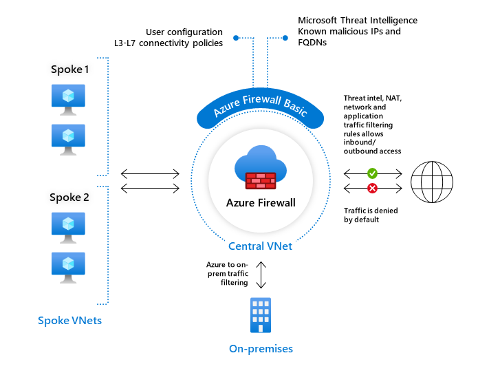

# Firewalls

Introductie:
Sinds alle bronnen in de cloud altijd online staan, is het belangrijk om deze te beveiligen tegen bedoeld en onbedoeld schadelijk verkeer. Azure Firewall kan VNets beschermen tegen dit verkeer.

Je kan de Firewall in verschillende configuraties gebruiken in een subnet, of in een hub-and-spoke network. Een Firewall heeft altijd een publiek IP adres waar al het inkomend verkeer naartoe gestuurd dient te worden. En een privé IP adres waar al het uitgaande verkeer naartoe moet.

Zoals je eerder geleerd hebt zijn er twee soorten firewalls: stateless, en stateful. Azure Firewall is een stateful firewall. 

Omdat Azure Firewall al het verkeer gedetailleerd monitort, is het een relatief dure service. Tijdens de opleiding gebruiken geen Azure Firewall, maar de goedkopere variant: Network Security Group (NSG).

Bestudeer: 
* Het verschil tussen Basic 

  

en Premium Firewall:  

  

* Het verschil tussen een Firewall en een Firewall beleid (Firewall Policy).
* Dat Azure Firewall veel meer is dan alleen een firewall.
* Het verschil tussen Azure Firewall en NSG.

Benodigdheden:
Je Azure Cloud omgeving (link)
Azure documentatie

## Key-terms
IDPS: Intrusion Detection Prevention System
NSG: Network Security Group
## Opdracht

**Zet een webserver aan. Zorg dat de poorten voor zowel SSH als HTTP geopend zijn.**

Eerst een nieuwe VM aangemaakt met de custom data (apache) zoals we dat al eerder deden:

SSH en HTTP waren allowed:

en ook zichtbaar vanuit de shell:  

**Maak een NSG in je VNET. Zorg ervoor dat je webserver nog steeds bereikbaar is via HTTP, maar dat SSH geblokkeerd wordt.**

Een nieuwe nsg aangemaakt in een nieuwe resource groep en daar de VM aan toegevoegd.

na reboot kon ik de VM niet meer in:

Maar deed de website het nog wel:

### Gebruikte bronnen
https://learn.microsoft.com/nl-nl/azure/firewall/overview#azure-firewall-premium

### Ervaren problemen
Was niet zeker hoe het werkte met NSG en of de regels daarin golden voor de hele groep, maar gezien de resultaten kan ik niet anders concluderen.

### Resultaat
zie boven.
