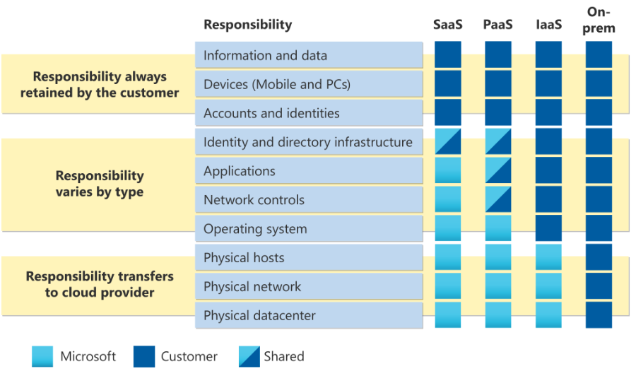

# Shared Responsibility Model

Introductie:
Als je zelf een datacenter beheert, ben je zeker dat je verantwoordelijk bent voor alles: van de fysieke beveiliging tot de beveiliging en encryptie van je data. Maar ook het onderhoud en het beheer van het gebouw waar je je datacenter hebt staan en al het personeel dat daarvoor nodig is.
In de Cloud worden veel van deze verantwoordelijkheden overgenomen. De Cloud Provider is dan verantwoordelijk voor de fysieke zaken van je infrastructuur. En kan jij, als klant, deze infrastructuur huren zonder hierover zorgen te hoeven maken.

Dit is echter geen vrijbrief. Jij, als klant, bent nog altijd verantwoordelijk voor wat je op deze gehuurde infrastructuur doet. Dit zijn verantwoordelijkheden zoals toegangsbeheer tot data en software, encryptie van data at rest en data in transit.
Hoeveel verantwoordelijkheden bij de klant liggen is ook afhankelijk van wat voor dienst er wordt afgenomen. Toch blijven er verantwoordelijkheden die altijd voor de klant zijn.

De Cloud provider extra biedt extra services aan waarmee je je eigen verantwoordelijkheden makkelijker kan beheren.

## Key-terms
[Schrijf hier een lijst met belangrijke termen met eventueel een korte uitleg.]

## Opdracht

Bestudeer:
Het Azure Shared Responsibility model

### Gebruikte bronnen
[Shared responsibility model](https://learn.microsoft.com/en-us/azure/security/fundamentals/shared-responsibility)

### Ervaren problemen

### Resultaat

