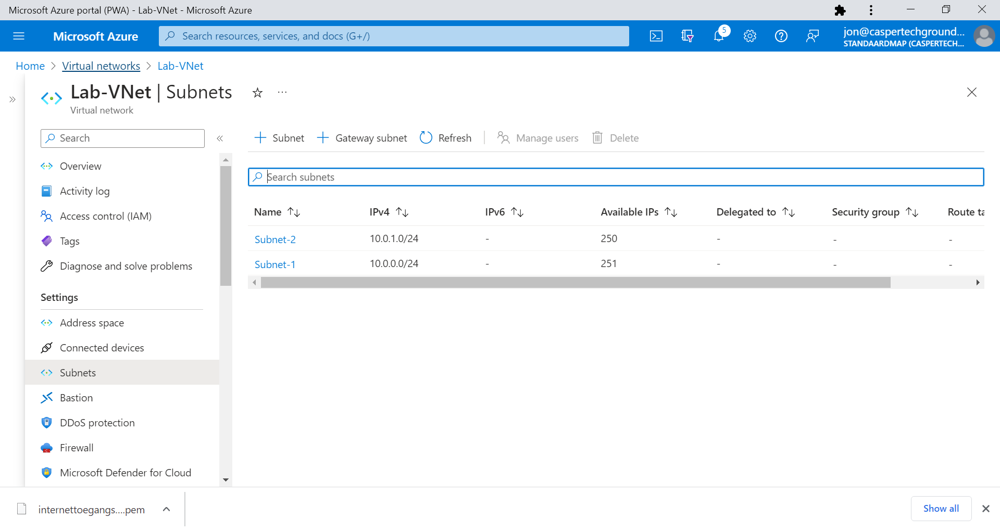
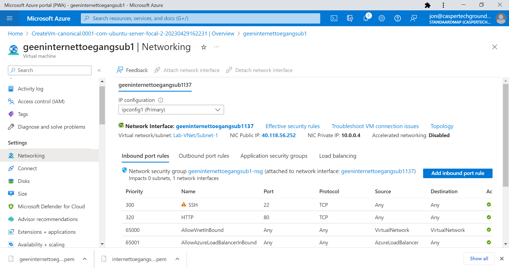
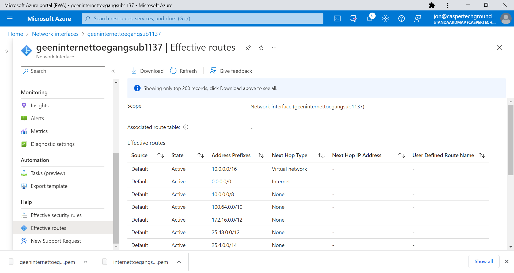
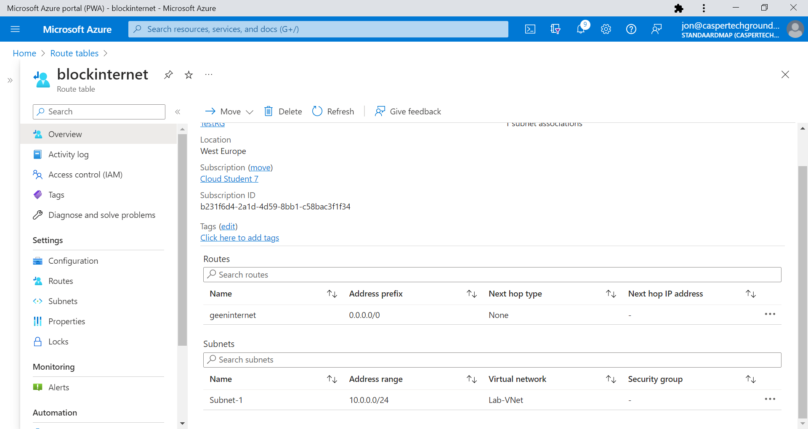
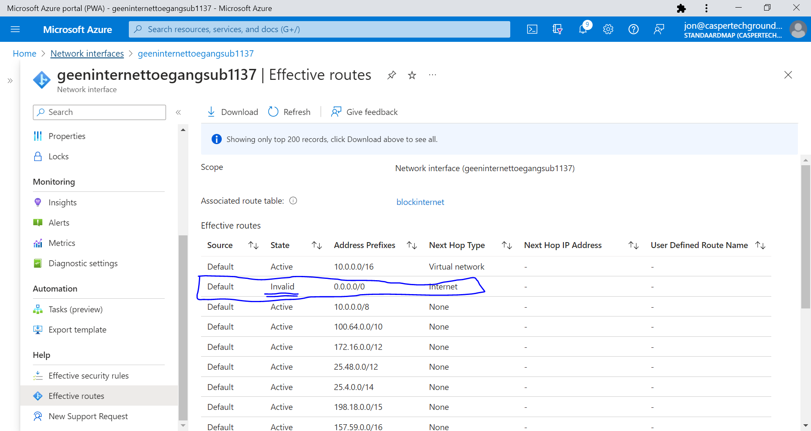
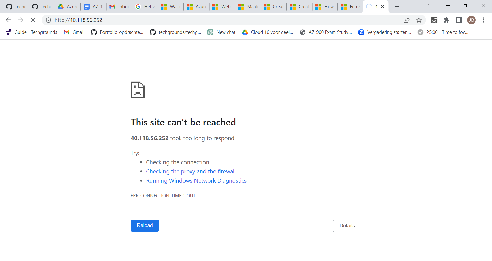
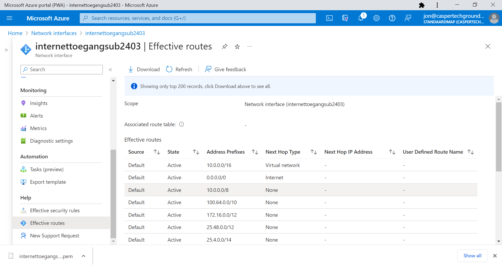
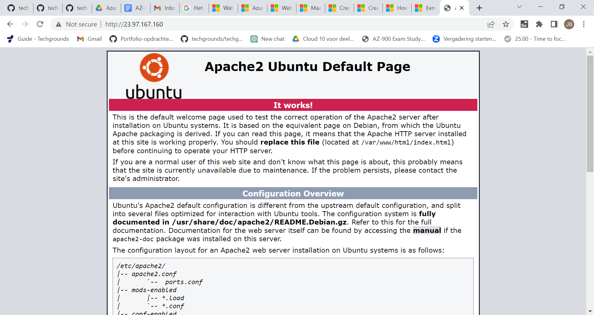

# Azure Virtual Network (VNet)

Introductie:
Azure virtual networks (VNets) zorgen ervoor dat resources als VMs, web apps en databases kunnen communiceren met elkaar, met gebruikers op het internet en met machines die on-premises staan.

VNets hebben de volgende verantwoordelijkheden:
* (Netwerk-)isolatie en -segmentatie
* Internetcommunicatie
* Communicatie tussen Azure resources
* Communicatie met on-premises resources
* Routeren van netwerkverkeer
* Filteren van netwerkverkeer
* Verbinden aan andere VNets

Wanneer je een nieuw VNet aanmaakt, bepaal je een private IP range voor je netwerk. Binnen die range kan je subnets aanmaken.

Er zijn drie manieren om je netwerk te verbinden aan een on-premises netwerk:
* Point-to-site VPNs:
    * Het Azure VNet wordt benaderd met een VPN vanaf een on-prem computer.
* Site-to-site VPNs:
    * De on-prem VPN device of gateway wordt verbonden met de Azure VPN Gateway. Hierdoor krijg je effectief 1 groot local network.
* Azure Expressroute:
    * Dit is een fysieke verbinding vanaf je lokale omgeving naar Azure.

Je kan ook twee Azure VNets met elkaar verbinden door middel van virtual network peering. Dit wordt mogelijk gemaakt door user-defined Routing (UDR). Peering is mogelijk met VNets in verschillende regions.

Benodigdheden:
Je Azure Cloud omgeving (link)

## Key-terms
NIC: Network Interface Card. Hierin worden de diverse netwerk routes gespecificeerd.

Route table: 
## Opdracht

Opdracht 1:
* Maak een Virtual Network met de volgende vereisten:
    * Region: West Europe
    * Name: Lab-VNet
    * IP range: 10.0.0.0/16
* Vereisten voor subnet 1:
    * Name: Subnet-1
    * IP Range: 10.0.0.0/24
    * Dit subnet mag geen route naar het internet hebben
* Vereisten voor subnet 2:
    * Name: Subnet-2
    * IP Range: 10.0.1.0/24

De 2 subnets zoals gevraagd:


En de VM die gekoppeld is aan subnet1 voor de aanpassingen. SHH en HTTP staan op allowed en de site was bereikbaar via de browser:


De effectieve routes van subnet1 met route naar het internet: 


Om dit te wijzigen heb ik een route table aangemaakt met 'blockinternet' met als address prefix: 0.0.0.0/0 en next hop type 'none' oftewel nergens heen en deze gekoppeld aan subnet1:



Vervolgens zagen de effectieve routes in de NIC er zo uit:


En de test erna mislukte succesvol:


Voor subnet2 hoefden de effectieve routes niet te worden aangepast. Ook hier blijkt dat de route naar het internet gedefinieerd is voor de laagste range IP adressen. M.a.w. alle ip adressen die gezocht worden die niet gespecificeerd zijn, worden geroute naar het internet.:



Opdracht 2:
Maak een VM met de volgende vereisten:
Een apache server moet met de volgende custom data geïnstalleerd worden:

```

#!/bin/bash
sudo su
apt update
apt install apache2 -y
ufw allow 'Apache'
systemctl enable apache2
systemctl restart apache2

```
*    * Er is geen SSH access nodig, wel HTTP
     * Subnet: Subnet-2
     * Public IP: Enabled


Controleer of je website bereikbaar is:

### Gebruikte bronnen
https://learn.microsoft.com/en-us/azure/virtual-network/quick-create-portal
https://learn.microsoft.com/en-us/answers/questions/427589/how-to-block-internet-access-in-azure-virtual-netw
https://learn.microsoft.com/en-us/azure/virtual-network/manage-route-table

Peers
Live demo in de les

### Ervaren problemen

Dacht het probleem gevonden te hebben door een NSG toe te wijzen met een servicetag "internet", maar in de les dit bleek niet genoeg en niet de achterliggende gedachte van de opdracht. We moesten een routetable aanmaken en die koppelen aan een subnet.  Door in de NIC te duiken werden de effectieve routes zichtbaar. De NIC wordt automatisch aangemaakt als je een VM creeert. Ik moet zeggen dat ik alleen door de live demo in de les begreep wat de bedoeling was en was ik hier zelf nooit achter gekomen. Wel blij dat ik het eindresultaat kon namaken en ik heb wat meer inzicht gekregen in hoe NSG werken. Hoe Azure het een en ander al geautomatiseerd heeft en vooral hoe routetables werken. 

### Resultaat
zie boven
