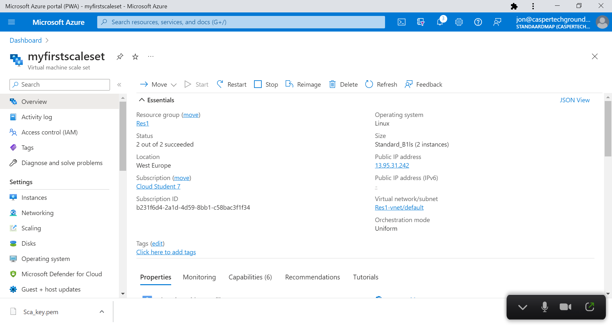
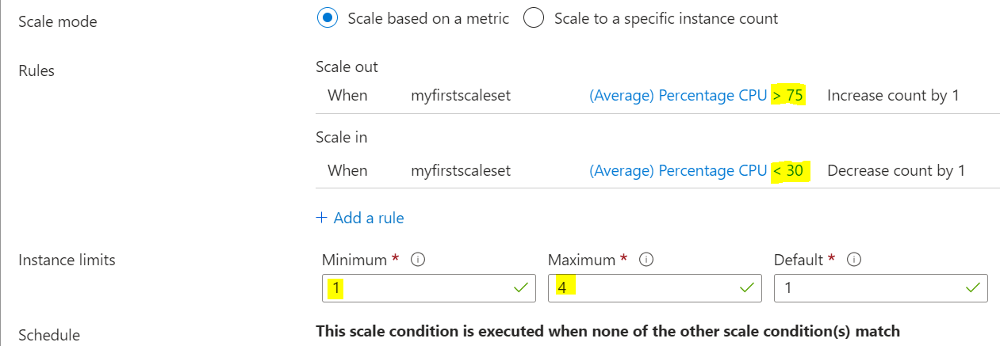
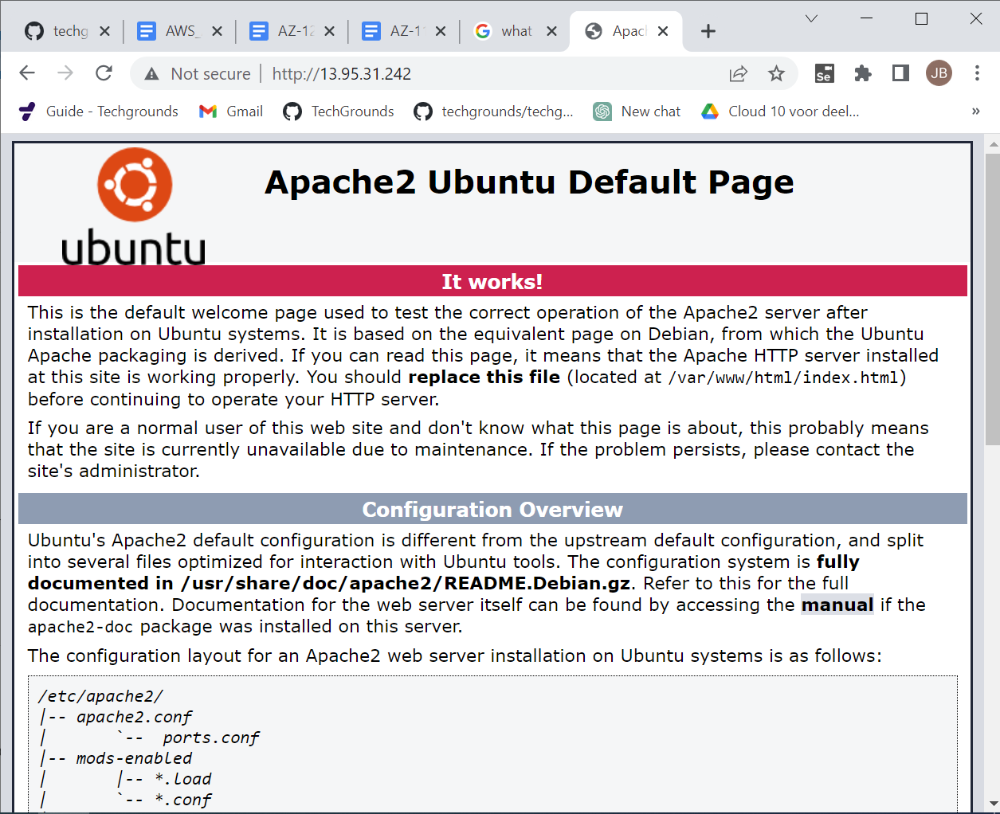
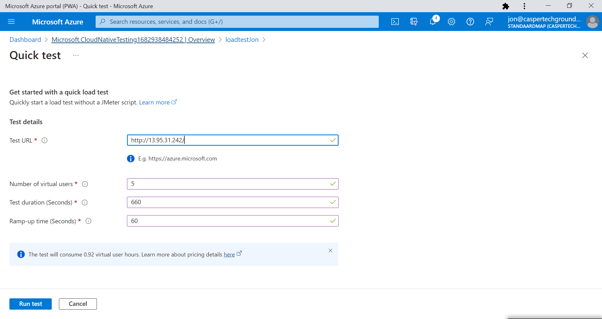
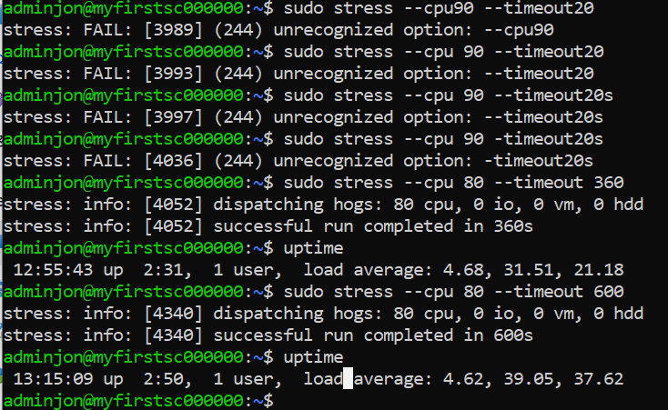
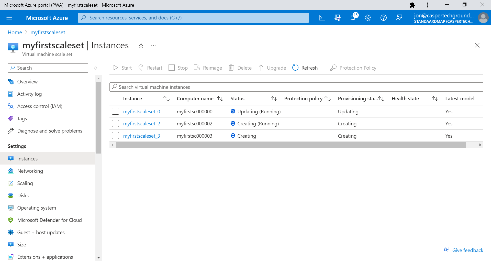
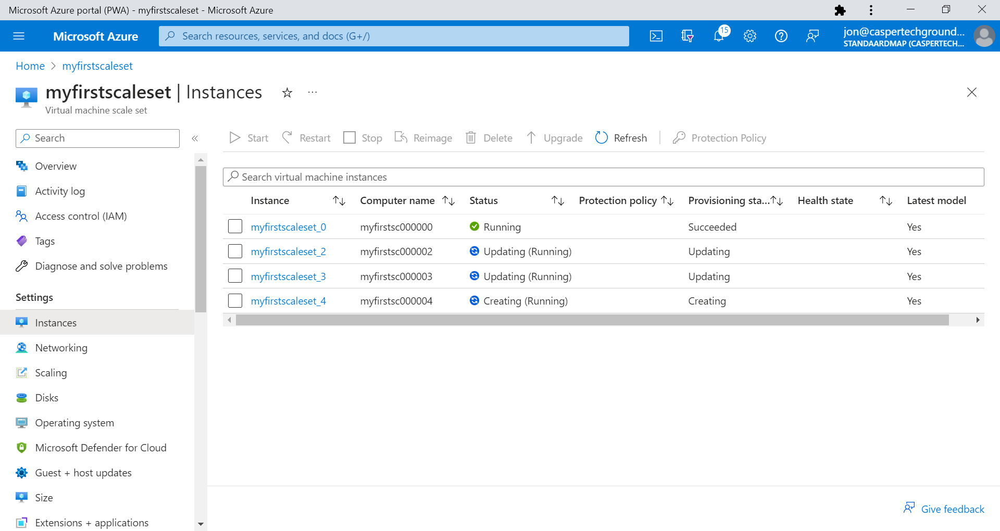

# Azure Load Balancer (ALB) & Auto Scaling

Introductie:
Een van de grootste voordelen van de cloud is dat je niet hoeft te gokken hoeveel capaciteit je nodig hebt. Je kan altijd up en down schalen met on-demand services. Een van de services die dit mogelijk maakt heet Autoscaling.

Wanneer je applicaties runt met een spiky workload, kan je een VM Scale Set aanmaken in plaats van een enkele server. Wanneer de vraag naar de applicatie hoog is, kan Autoscaling automatisch VMs toevoegen aan je Scale Set. Wanneer de vraag omlaag gaat, kan het ook weer instances verwijderen.

Om er zeker van te zijn dat alle VMs hetzelfde zijn, moet je een image aanwijzen tijdens het configureren van een VM Scale Set. Je kan deze image later aanpassen met de reimage optie. Auto Scaling maakt gebruik van Azure Monitor om te bepalen of er VMs toegevoegd of verwijderd moeten worden.

In een traditionele architectuur maakt een client verbinding met een enkele server met een enkel publiek IP-adres. Wanneer je een fleet van servers hebt, werkt dit niet meer. Daarom kan je een load balancer gebruiken als endpoint voor de client. De load balancer zal de request forwarden naar een van de servers in je fleet en het antwoord terugsturen naar de client.

Azure heeft twee managed oplossingen voor load balancing naar een fleet van servers:
* Azure Load Balancer: Je krijgt deze gratis bij een VM Scale Set. De ALB werkt op laag 4 van de OSI stack (TCP/UDP). Een ALB kan alleen routeren naar Azure resources.
* Application Gateway: Deze load balancer werkt op laag 7 van de OSI stack (HTTP/HTTPS). Ook heeft het support voor onder andere SSL termination en Web Application Firewall (WAF) features. Een Application Gateway kan routeren naar elk routable IP address.

Benodigdheden:
Je Azure Cloud omgeving (link)

## Key-terms

## Opdracht

Opdracht 1:
* Maak een Virtual Machine Scale Set met de volgende vereisten:
    * Ubuntu Server 20.04 LTS - Gen1
    * Size: Standard_B1ls
    * Allowed inbound ports:
        * SSH (22)
        * HTTP (80)
    * OS Disk type: Standard SSD
    * Networking: defaults
    * Boot diagnostics zijn niet nodig
    * Custom data:

```
#!/bin/bash
sudo su
apt update
apt install apache2 -y
ufw allow 'Apache'
systemctl enable apache2
systemctl restart apache2
```

*   * Initial Instance Count: 2
    * Scaling Policy: Custom
        * Aantal VMs: minimaal 1 en maximaal 4
    * Voeg een VM toe bij 75% CPU gebruik
    * Verwijder een VM bij 30% CPU gebruik  



Opdracht 2:
* Controleer of je via het endpoint van je load balancer bij de webserver kan komen.  

 
* Voer een load test uit op je server(s) om auto scaling the activeren. Er kan een delay zitten in het creëren van nieuwe VMs, afhankelijk van de settings in je VM Scale Set.

Here we go:



Hmm de output van bovenstaande gaf geen duidelijke conclusies met de kennis die ik nu heb. Waarschijnlijk zou ik e.e.a. moeten kunnen terugvinden in log files, maar dan nog weet ik niet of bovenstaande test parameters genoeg waren.

Als alternatief, zoals uit de Q&A bleek, kan je ook in de shell een stress-test uitvoeren:

```
sudo apt-get install stress
```
&
```
sudo stress --cpu 80 --timeout 360
```


Tijdens de test schoot het CPU gebruik naar 95% in de portal en werden er VM's aangemaakt;




### Gebruikte bronnen
https://www.tecmint.com/linux-cpu-load-stress-test-with-stress-ng-tool/  
### Ervaren problemen
Met een loadtest in de portal werd het niet duidelijk of en wanneer er nieuwe VM's werden aangemaakt. Bovendien kostte de test maar liefst eur9.06. De stress command in linux was gratis en gaf meteen een scaling resultaat.

### Resultaat

Zie boven.