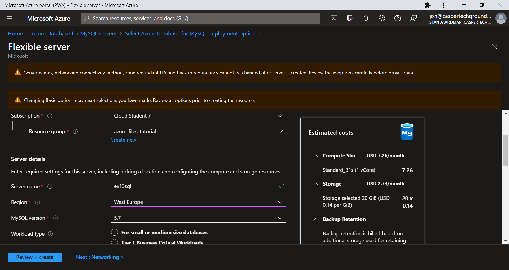

# Introductie:
Vanaf dit moment zullen wij, als learning coaches, jullie minder opdrachten geven. We zullen meer beroep doen op je zelfstandig leervaardigheden. Geen zorgen, je bent niet alleen. Je hebt elkaar en de vaste dagelijkse structuur blijft bestaan waarin je ons nog altijd de oren van ons hoofd kan vragen.

Onderwerpen die je onder de kop “Bestudeer” vindt verwachten wij dat je alleen op een theoretisch niveau hoeft te kennen. Van onderwerpen onder de kop “Opdrachten” moet je ook praktische ervaring opbouwen.

Handige vragen die je in gedachten kan (/moet) houden tijdens je onderzoek naar de onderwerpen:
* Waar is X voor?
* Hoe past X / vervangt X in een on-premises setting?
* Hoe kan ik X combineren met andere diensten?
* Wat is het verschil tussen X en andere gelijksoortige diensten?

Een handige lijst van taken die je praktisch moet kunnen:
* Waar kan ik deze dienst vinden in de console?
* Hoe zet ik deze dienst aan?
* Hoe kan ik deze dienst koppelen aan andere resources?

Benodigdheden:
* Je Azure omgeving     				/ AWS omgeving

## Key-terms
SMB: Server Message Block Protocol is a network file sharing protocol. The Common Internet File System (CIFS) Protocol is a dialect of SMB. It's main purpose is file sharing. Azure Files offers two industry-standard protocols for mounting Azure file share: the Server Message Block (SMB) protocol and the Network File System (NFS) protocol. Azure Files enables you to pick the file system protocol that is the best fit for your workload.

PoP: Point of Presence locations that are close to end users to minimize latency. (CDN)

TTL: Time to Live (usually specified in HTTP header) for an 'asset' (file) to remain cached on an edge server. If not specified the default TTL is 7 days.

## Opdracht

Bestudeer:

App Service       					/ Elastic Beanstalk

An App Service Environment can host your:

* Windows web apps
* Linux web apps
* Docker containers (Windows and Linux)
* Functions
* Logic apps (Standard)

App Service Environments are appropriate for application workloads that require:

* High scale.
* Isolation and secure network access.
* High memory utilization.
* High requests per second (RPS). You can create multiple App Service Environments in a single Azure region or across multiple Azure regions. This flexibility makes an App Service Environment ideal for horizontally scaling stateless applications with a high RPS requirement.

An App Service Environment can host applications from only one customer, and they do so on one of their virtual networks. Customers have fine-grained control over inbound and outbound application network traffic. Applications can establish high-speed secure connections over VPNs to on-premises corporate resources.

Content Delivery Network (CDN) 		/ CloudFront

A content delivery network (CDN) is a distributed network of servers that can efficiently deliver web content to users. A CDN store cached content on edge servers in point-of-presence (POP) locations that are close to end users, to minimize latency.

Azure CDN offers developers a global solution for rapidly delivering high-bandwidth content to users by caching their content at strategically placed physical nodes across the world. Azure CDN can also accelerate dynamic content, which can't get cached, by using various network optimizations using CDN POPs. For example, route optimization to bypass Border Gateway Protocol (BGP).

The benefits of using Azure CDN to deliver web site assets include:

* Better performance and improved user experience for end users, especially when using applications where multiple round-trips requests required by end users to load contents.
* Large scaling to better handle instantaneous high loads, such as the start of a product launch event.
* Distribution of user requests and serving of content directly from edge servers so that less traffic gets sent to the origin server.

How it works
CDN Overview:

1. A user (Alice) requests a file (also called an asset) by using a URL with a special domain name, such as <endpoint name>.azureedge.net. This name can be an endpoint hostname or a custom domain. The DNS routes the request to the best performing POP location, which is usually the POP that is geographically closest to the user.

2. If no edge servers in the POP have the file in their cache, the POP requests the file from the origin server. The origin server can be an Azure Web App, Azure Cloud Service, Azure Storage account, or any publicly accessible web server.

3. The origin server returns the file to an edge server in the POP.

4. An edge server in the POP caches the file and returns the file to the original requestor (Alice). The file remains cached on the edge server in the POP until the time-to-live (TTL) specified by its HTTP headers expires. If the origin server didn't specify a TTL, the default TTL is seven days.

5. More users can then request the same file by using the same URL that Alice used, and gets directed to the same POP.

6. If the TTL for the file hasn't expired, the POP edge server returns the file directly from the cache. This process results in a faster, more responsive user experience.

**Requirements**  

* To use Azure CDN, you must own at least one Azure subscription.
* You also need to create a CDN profile, which is a collection of CDN endpoints. Every CDN endpoint is a specific configuration which users can customize with required content delivery behavior and access. To organize your CDN endpoints by internet domain, web application, or some other criteria, you can use multiple profiles.
* Since Azure CDN pricing gets applied at the CDN profile level, so if you want to use a mix of pricing tiers you must create multiple CDN profiles. 

Limitations: 

Each Azure subscription has default limits for the following resources:

* The number of CDN profiles created.
* The number of endpoints created in a CDN profile.
* The number of custom domains mapped to an endpoint.  

For more information about CDN subscription limits, see CDN limits.

**Azure CDN features**  

Azure CDN offers the following key features:

* Dynamic site acceleration
* CDN caching rules
* HTTPS custom domain support
* Azure diagnostics logs
* File compression
* Geo-filtering

Azure DNS 					/ Route53

Azure DNS is a hosting service for DNS domains that provides name resolution by using Microsoft Azure infrastructure. By hosting your domains in Azure, you can manage your DNS records by using the same credentials, APIs, tools, and billing as your other Azure services.

You can't use Azure DNS to buy a domain name. For an annual fee, you can buy a domain name by using App Service domains or a third-party domain name registrar. Your domains then can be hosted in Azure DNS for record management. For more information, see Delegate a domain to Azure DNS.

The following features are included with Azure DNS.

**Reliability and performance**  

DNS domains in Azure DNS are hosted on Azure's global network of DNS name servers. Azure DNS uses anycast networking. Each DNS query is answered by the closest available DNS server to provide fast performance and high availability for your domain.

**Security** 

Azure DNS is based on Azure Resource Manager, which provides features such as:

* Azure role-based access control (Azure RBAC) to control who has access to specific actions for your organization.

* Activity logs to monitor how a user in your organization modified a resource or to find an error when troubleshooting.

* Resource locking to lock a subscription, resource group, or resource. Locking prevents other users in your organization from accidentally deleting or modifying critical resources.

For more information, see [How to protect DNS zones and records.](https://learn.microsoft.com/en-us/azure/dns/dns-protect-zones-recordsets)

**~~DNSSEC~~** 

Azure DNS does not currently support DNSSEC. In most cases, you can reduce the need for DNSSEC by consistently using HTTPS/TLS in your applications. If DNSSEC is a critical requirement for your DNS zones, you can host these zones with third-party DNS hosting providers.

**Ease of use**

Azure DNS can manage DNS records for your Azure services and provide DNS for your external resources as well. Azure DNS is integrated in the Azure portal and uses the same credentials, support contract, and billing as your other Azure services.

DNS billing is based on the number of DNS zones hosted in Azure and on the number of DNS queries received. To learn more about pricing, see Azure DNS pricing.

Your domains and records can be managed by using the Azure portal, Azure PowerShell cmdlets, and the cross-platform Azure CLI. Applications that require automated DNS management can integrate with the service by using the REST API and SDKs.

**Customizable virtual networks with private domains**

Azure DNS also supports private DNS domains. This feature allows you to use your own custom domain names in your private virtual networks rather than the Azure-provided names available today.

For more information, see Use Azure DNS for private domains.

**Alias records**

Azure DNS supports alias record sets. You can use an alias record set to refer to an Azure resource, such as an Azure public IP address, an Azure Traffic Manager profile, or an Azure Content Delivery Network (CDN) endpoint. If the IP address of the underlying resource changes, the alias record set seamlessly updates itself during DNS resolution. The alias record set points to the service instance, and the service instance is associated with an IP address.

Also, you can now point your apex or naked domain to a Traffic Manager profile or CDN endpoint using an alias record. An example is contoso.com

----  

Practical:

**Azure Files:**

* Fully managed file shares in the cloud accessible via
    * SMB (Server Message Block)
    * HTTP (FileREST)
* Subservice of Azure Storage Account

* Perfect for "Lift and shift" applications 

* Replace/extend on-premise servers as a cache with Azure File Sync (With Azure file sync Clients can access with NFS/SMB/FTP protocols)

* Persistent Storage for containers

Make a storage account and create a new File share:

Het script voor het maken van een windows VM heb ik van deze [repo](https://github.com/MarczakIO/azure4everyone-samples/blob/master/azure-files-introduction/create-windows-vm.sh) gehaald. En vervolgens gerund in de cloud shell in de portal.

Connect vervolgens met de 'newfileshare' (show script)

copy paste script in de VM powershell:

En upload een plaatje in de portal:

Terug in de VM kan je de file dan uitlezen en evt. een nieuw bestand (.txt) toevoegen:

Het nieuwe text bestand is na refresh ook meteen zichtbaar in de fileshare:

Je hoeft natuurlijk geen gebruik te maken van scripts in de powershell en het via de windows GUI mounten. Terug naar powershell, properties, copy de url (zonder https):

Terug naar de VM en eerst disconnecten:

Vervolgens: 

Copy url vanaf de portal:

en paste:

et voila:

Natuurlijk kan je ook connecten met een Linux VM, maar dan moet het mounten vanaf de commandline gebeuren wat we al eerder deden in AZ-07. 

Verder kunnen er van Filed share ook snapshots gemaakt worden zodat je een version control creert.

**Azure Database (+ managed instance)**
Azure SQL Managed Instance is the intelligent, scalable cloud database service that combines the broadest SQL Server database engine compatibility with all the benefits of a fully managed and evergreen platform as a service. [gemanaged door de cloudprovider]
----
SQL = structured query language is relational. M.a.w. meerdere kleine tabellen waarvan de gegevens relatief zijn aan elkaar. Bv een Pizzazaak die een tabel bijdhoudt met ingredienten en een tabel met bestellingen. De relatie tot elkaar kan zijn; Hoeveel ingredienten heb ik in totaal nodig voor X aantal bestellingen. Of: waar is ingredient Y, hoeveel is er nog nodig van ingredient Y, hoeveel moet ik bijbestellen van ingredient XYZ na X aantal bestellingen? Oftewel makkelijk te query-en. (shared keys)

 Non-relational database; (not-SQL (lees: 'not only SQL')) 
 Een grote tabel waarin je data kan filteren. Probleem: niet heel snel uit te lezen als je miljoenen data punten hebt. Om 1 query op te lossen, moet heel de database uitgelezen worden. Voordeel is dat je niet zo'n strakke struktuur nodig hebt bovendien hoef je niet iedere tabel opnieuw te updaten dus is het schalen makkelijker, maar dus ook trager om te lezen. Relaties tussen data is moeilijker uit te lezen, want er is eerst een filter nodig. Wel is het weer makkelijker voor big data waarbij je veel uit te lezen hebt, maar dat proces in principe maar 1 keer nodig hebt, om antwoord te krijgen op een query. Bijvoorbeeld: "Waar klikken mensen op mijn site het meest?"

Tegenwoordig wordt er veel gebruik gemaakt van best of  both worlds; wel relationeel gecombineerd met niet relationeel al naar gelang de situatie. 

Unstructured data gaat naar nonrelational database. Structured data gaat naar SQL. 
----

Vanwege de kosten heb ik besloten geen SQL server aan te maken, maar ik had het op deze manier gedaan:

[Leuk filmpje over Azure SQL](https://www.youtube.com/watch?v=BgvEOkcR0Wk)

### Gebruikte bronnen
[Documentatie over App Service](https://learn.microsoft.com/en-us/azure/app-service/environment/overview)

[Documentatie over Azure CDN](https://learn.microsoft.com/en-us/azure/cdn/cdn-overview)

[Documentatie over Azure DNS](https://learn.microsoft.com/en-us/azure/dns/dns-overview)

[Documentatie over Azure files](https://learn.microsoft.com/en-us/azure/storage/files/storage-files-introduction)

[Documentatie over Azure SQL Managed Instance](https://learn.microsoft.com/en-us/azure/azure-sql/managed-instance/sql-managed-instance-paas-overview?view=azuresql)

### Ervaren problemen
De kosten voor het aanmaken van een SQL server waren wat aan de hoge kant.
### Resultaat
Zie boven