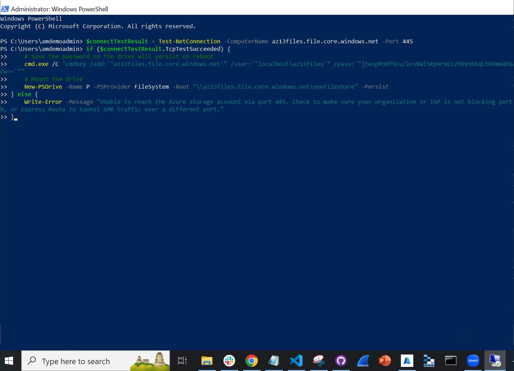

# Introductie:
Vanaf dit moment zullen wij, als learning coaches, jullie minder opdrachten geven. We zullen meer beroep doen op je zelfstandig leervaardigheden. Geen zorgen, je bent niet alleen. Je hebt elkaar en de vaste dagelijkse structuur blijft bestaan waarin je ons nog altijd de oren van ons hoofd kan vragen.

Onderwerpen die je onder de kop “Bestudeer” vindt verwachten wij dat je alleen op een theoretisch niveau hoeft te kennen. Van onderwerpen onder de kop “Opdrachten” moet je ook praktische ervaring opbouwen.

Handige vragen die je in gedachten kan (/moet) houden tijdens je onderzoek naar de onderwerpen:
* Waar is X voor?
* Hoe past X / vervangt X in een on-premises setting?
* Hoe kan ik X combineren met andere diensten?
* Wat is het verschil tussen X en andere gelijksoortige diensten?

Een handige lijst van taken die je praktisch moet kunnen:
* Waar kan ik deze dienst vinden in de console?
* Hoe zet ik deze dienst aan?
* Hoe kan ik deze dienst koppelen aan andere resources?

Benodigdheden:
* Je Azure omgeving     				/ AWS omgeving

## Key-terms
SMB: Server Message Block Protocol is a network file sharing protocol. The Common Internet File System (CIFS) Protocol is a dialect of SMB. It's main purpose is file sharing. Azure Files offers two industry-standard protocols for mounting Azure file share: the Server Message Block (SMB) protocol and the Network File System (NFS) protocol. Azure Files enables you to pick the file system protocol that is the best fit for your workload.

## Opdracht

Bestudeer:

App Service       					/ Elastic Beanstalk

An App Service Environment can host your:

* Windows web apps
* Linux web apps
* Docker containers (Windows and Linux)
* Functions
* Logic apps (Standard)

App Service Environments are appropriate for application workloads that require:

* High scale.
* Isolation and secure network access.
* High memory utilization.
* High requests per second (RPS). You can create multiple App Service Environments in a single Azure region or across multiple Azure regions. This flexibility makes an App Service Environment ideal for horizontally scaling stateless applications with a high RPS requirement.

An App Service Environment can host applications from only one customer, and they do so on one of their virtual networks. Customers have fine-grained control over inbound and outbound application network traffic. Applications can establish high-speed secure connections over VPNs to on-premises corporate resources.

Content Delivery Network (CDN) 		/ CloudFront

Azure DNS 					/ Route53

----  

Practical:

**Azure Files:**

* Fully managed file shares in the cloud accessible via
    * SMB (Server Message Block)
    * HTTP (FileREST)
* Subservice of Azure Storage Account

* Perfect for "Lift and shift" applications 

* Replace/extend on-premise servers as a cache with Azure File Sync (Will sync so Clients can access with NFS/SMB/FTP)

* Persistent Storage for containers

Make a storage account and create a new File share:

Het script voor het maken van een windows VM heb ik van deze [repo](https://github.com/MarczakIO/azure4everyone-samples/blob/master/azure-files-introduction/create-windows-vm.sh) gehaald.

Connect vervolgens met de 'newfileshare' (show script)

copy paste script in de VM powershell:

En upload een plaatje in de portal:

Terug in de VM kan je de file dan uitlezen en evt. een nieuw bestand (.txt) toevoegen:

Het nieuwe text bestand is na refresh ook meteen zichtbaar in de fileshare:

Je hoeft natuurlijk geen gebruik te maken van scripts in de powershell en het via de windows GUI mounten. Terug naar powershell, properties, copy de url (zonder https):

Terug naar de VM en eerst disconnecten:

Vervolgens: 

Copy url vanaf de portal:

en paste:

et voila:

Natuurlijk kan je ook connecten met een Linux VM, maar dan moet het mounten vanaf de commandline gebeuren wat we al eerder deden in AZ-07. 

Verder kunnen er van Filed share ook snapshots gemaakt worden zodat je een version control creert.

**Azure Database (+ managed instance)**

[Relational 1. relaties (tabellen van data) meerdere kleine tabellen waarin relaties staan bv. Pizzazaak tabel met ingredienten en een tabel met bestellingen. (hoeveel ingredienten heb ik in totaal nodig etc.) (sql. structured query language (bv where is ingredient a, stock?, need orders? makkelijk querying)) (shared keys (?)) & non-relational database (not- ('not only sql') sql) een grote tabel waarin je data kan filteren. probleem: niet heel snel als je miljoenen data punten hebt. heel de database moet gelezen worden om een query op te lossen. voordeel is dat je niet zo'n strakke struktuur hebt. Je hoeft niet iedere tabel opnieuw te updaten dus makkelijker schaalbaar. ook trager dus om te lezen. relaties tussen data is moeilijker uit te lezen. makkelijk voor big data.

Tegenwoordig: best of  both worlds, wel relationeel samen met niet relationeel al naar gelang de situatie. unstructured data gaat naar nonrelational, structured data gaat naar sql] 

Azure SQL Managed Instance is the intelligent, scalable cloud database service that combines the broadest SQL Server database engine compatibility with all the benefits of a fully managed and evergreen platform as a service. [gemanaged door de cloudprovider]

### Gebruikte bronnen
[Documentatie over Azure files](https://learn.microsoft.com/en-us/azure/storage/files/storage-files-introduction)

[Documentatie over App Service](https://learn.microsoft.com/en-us/azure/app-service/environment/overview)

### Ervaren problemen

### Resultaat
[Omschrijf hoe je weet dat je opdracht gelukt is (gebruik screenshots waar nodig).]
