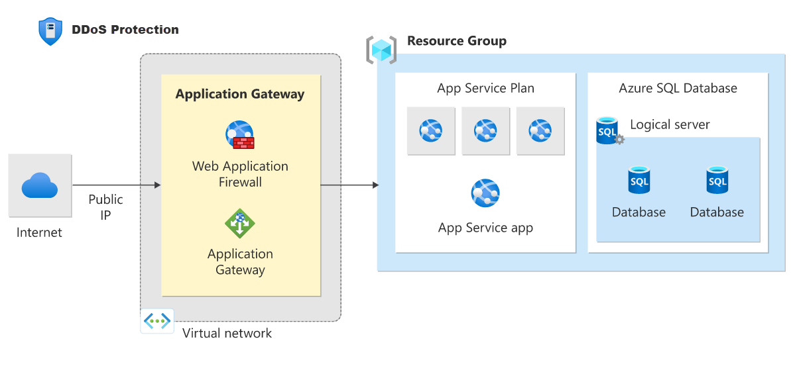
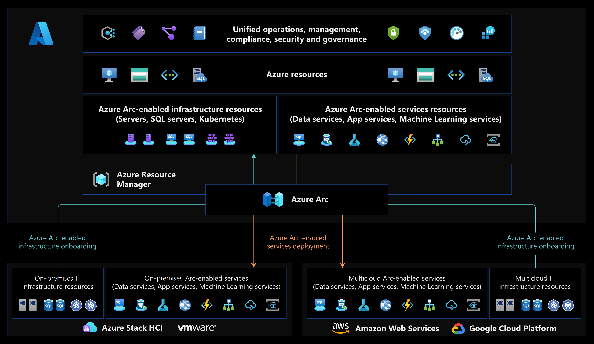

### Initiative Definition:  

An initiative definition is a collection of policy definitions that are tailored toward achieving a singular overarching goal. Initiative definitions simplify managing and assigning policy definitions. They simplify by grouping a set of policies as one single item. For example, you could create an initiative titled Enable Monitoring in Microsoft Defender for Cloud, with a goal to monitor all the available security recommendations in your Microsoft Defender for Cloud instance.

---
**Note**

The SDK, such as Azure CLI and Azure PowerShell, use properties and parameters named *PolicySet* to refer to initiatives.

---

Under this initiative, you would have policy definitions such as:

* Monitor unencrypted SQL Database in Microsoft Defender for Cloud - For monitoring unencrypted SQL databases and servers.
* Monitor OS vulnerabilities in Microsoft Defender for Cloud - For monitoring servers that don't satisfy the configured baseline.
* Monitor missing Endpoint Protection in Microsoft Defender for Cloud - For monitoring servers without an installed endpoint protection agent.

Like policy parameters, initiative parameters help simplify initiative management by reducing redundancy. Initiative parameters are parameters being used by the policy definitions within the initiative.

[link naar dit onderwerp](https://learn.microsoft.com/en-us/azure/governance/policy/overview#initiative-definition)

### DDOS Protection

Azure DDoS Protection, combined with application design best practices, provides enhanced DDoS mitigation features to defend against DDoS attacks. It's automatically tuned to help protect your specific Azure resources in a virtual network. Protection is simple to enable on any new or existing virtual network, and it requires no application or resource changes.

**SKUs**  

Azure DDoS Protection supports two SKU Types, DDoS IP Protection and DDoS Network Protection. The SKU is configured in the Azure portal during the workflow when you configure Azure DDoS Protection.

The following table shows features and corresponding SKUs.

|Feature|DDoS IP Protection|DDoS Network Protection|
|:----|:----|:----|
|Active traffic monitoring & always on detection|Yes|Yes|
|L3/L4 Automatic attack mitigation|Yes|Yes|
|Automatic attack mitigation|Yes|Yes|
|Application based mitigation policies|Yes|Yes|
|Metrics & alerts|Yes|Yes|
|Mitigation reports|Yes|Yes|
|Mitigation flow logs|Yes|Yes|
|Mitigation policies tuned to customers application|Yes|Yes|
|Integration with Firewall Manager|Yes|Yes|
|Microsoft Sentinel data connector and workbook|Yes|Yes|
|Protection of resources across subscriptions in a tenant|Yes|Yes|
|Public IP Standard SKU protection|Yes|Yes|
|Public IP Basic SKU protection|No|Yes|
|DDoS rapid response support|Not available|Yes|
|Cost protection|Not available|Yes|
|WAF discount|Not available|Yes|
|Price|Per protected IP|Per 100 protected IP|

---
**Note**

At no additional cost, Azure DDoS infrastructure protection protects every Azure service that uses public IPv4 and IPv6 addresses. This DDoS protection service helps to protect all Azure services, including platform as a service (PaaS) services such as Azure DNS. For more information on supported PaaS services, see DDoS Protection reference architectures. Azure DDoS infrastructure protection requires no user configuration or application changes. Azure provides continuous protection against DDoS attacks. DDoS protection does not store customer data.

---
[link naar dit onderwerp](https://learn.microsoft.com/en-us/azure/ddos-protection/ddos-protection-overview)

### Arc

Tegenwoordig hebben bedrijven moeite met het beheren en beheren van steeds complexere omgevingen die zich uitstrekken over datacenters, meerdere clouds en edge. Elke omgeving en cloud beschikt over een eigen set beheerhulpprogramma's, en nieuwe operationele devOps- en ITOps-modellen kunnen moeilijk te implementeren zijn tussen resources.

Azure Arc vereenvoudigt governance en beheer door een consistent multicloud- en on-premises beheerplatform te bieden.

Azure Arc biedt een gecentraliseerde, uniforme manier om het volgende te doen:

* Beheer uw hele omgeving samen door uw bestaande niet-Azure- en/of on-premises resources te projecteren in Azure Resource Manager.
* Virtuele machines, Kubernetes-clusters en databases beheren alsof ze worden uitgevoerd in Azure.
* Gebruik vertrouwde Azure-services en beheermogelijkheden, ongeacht waar uw resources zich bevinden.
* Blijf traditionele ITOps gebruiken terwijl u DevOps-procedures introduceert ter ondersteuning van nieuwe cloudeigen patronen in uw omgeving.
* Configureer aangepaste locaties als een abstractielaag boven op Kubernetes-clusters en clusterextensies met Azure Arc.

Op dit moment kunt u met Azure Arc de volgende resourcetypen beheren die buiten Azure worden gehost:

* Servers: beheer fysieke Windows- en Linux-servers en virtuele machines die buiten Azure worden gehost.
* Kubernetes-clusters: Koppel en configureer Kubernetes-clusters die overal worden uitgevoerd, met meerdere ondersteunde distributies.
* Azure-gegevensservices: Voer Azure-gegevensservices on-premises, aan de rand en in openbare clouds uit met behulp van Kubernetes en de infrastructuur van uw keuze. SQL Managed Instance- en PostgreSQL-services (preview) zijn momenteel beschikbaar.
* SQL Server: Azure-services uitbreiden naar SQL Server instanties die buiten Azure worden gehost.
* Virtuele machines (preview): virtuele machines inrichten, het formaat ervan wijzigen, verwijderen en beheren op basis van VMware vSphere of Azure Stack HCI en selfservice voor VM's inschakelen via toegang op basis van rollen.

[Link naar dit onderwerp](https://learn.microsoft.com/nl-nl/azure/azure-arc/overview)

