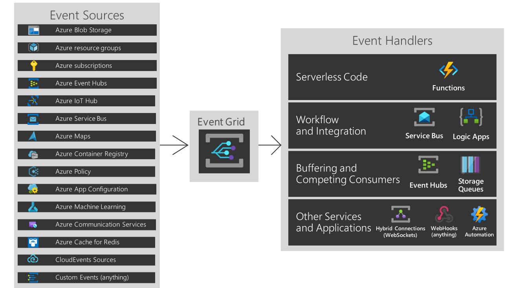

# Onderwerpen Cloud Fundamentals Week 6

Introductie:
Welkom bij de laatste week voor het examen waarin wij nog nieuwe onderwerpen introduceren. Volgende week zullen wij vooral voorbereidingen treffen voor het certificeringsexamen.

Tijdens het leren voor dit examen zal je hoogstwaarschijnlijk nog nieuwe diensten tegen komen tijdens, bijvoorbeeld, oefenexamens. Je zult deze nieuwe diensten ook moeten kennen. Het detail wat je moet weten voor het examen is alleen niet zo hoog als je hiervoor met de behandelende diensten heb gedaan.

Vragen die je kan stellen over nieuwe diensten die je tegen komt:
Waar is X voor?
Waar wordt X voor gebruikt?
Zoals je kan zien is dit lijstje stukken korter dan wat wij hiervoor hebben behandeld.

Hier zijn nogmaals de lijstjes vragen voor je onderzoek:
Vragen voor theoretisch onderzoek:
Waar is X voor?
Hoe past X / vervangt X in een on-premises setting?
Hoe kan ik X combineren met andere diensten?
Wat is het verschil tussen X en andere gelijksoortige diensten?

Vragen voor praktisch onderzoek:
Waar kan ik deze dienst vinden in de console?
Hoe zet ik deze dienst aan?
Hoe kan ik deze dienst koppelen aan andere resources?

## Key-terms  

*Event-driven architecture style*   

An event-driven architecture consists of event producers that generate a stream of events, and event consumers that listen for the events.  

An event driven architecture can use a publish/subscribe (also called pub/sub) model or an event stream model.

* Pub/sub: The messaging infrastructure keeps track of subscriptions. When an event is published, it sends the event to each subscriber. After an event is received, it can't be replayed, and new subscribers don't see the event.

* Event streaming: Events are written to a log. Events are strictly ordered (within a partition) and durable. Clients don't subscribe to the stream, instead a client can read from any part of the stream. The client is responsible for advancing its position in the stream. That means a client can join at any time, and can replay events.

[Documentatie over event driven architectures](https://learn.microsoft.com/en-us/azure/architecture/guide/architecture-styles/event-driven)  

----
**Containers**: Een standaardpakket van software bundelt de code van een toepassing samen met de bijbehorende configuratiebestanden, bibliotheken en afhankelijkheden die nodig zijn om de app uit te voeren. Op die manier kunnen ontwikkelaars en IT-professionals toepassingen naadloos in verschillende omgevingen implementeren.  
[Documentatie over containers](https://azure.microsoft.com/nl-nl/resources/cloud-computing-dictionary/what-is-a-container)  

**Azure Support Plans**: (4 niveaus) 

*Basic*: Gratis, geen actieve Azure support.

*Developer*: eur29/mnd, actieve support via email, 8hr response-tijd, voor test- en niet-productie omgevingen.

*Standard*: eur100/mnd, 24/7 support, 1hr response-tijd, voor productieomgevingen.

*Professional Direct*: eur1000/mnd, 24/7 support + operational support + training + proactieve hulp, 1hr response-tijd, noodzakelijk voor zakelijk kritieke omgevingen.  

[Documentatie over Azure Support Plans](https://azure.microsoft.com/nl-nl/support/plans)  

**Azure Advisor**: Gratis 'handleiding' of 'gids' die adviseert op basis van het 'Well-Architected Framework' van Azure. Beschikbaar in de portal.
[Documentatie over Azure Advisor](https://azure.microsoft.com/nl-nl/products/advisor#features)

**Azure APP Configuration**: 

*provides a service to centrally manage application settings and feature flags*. Modern programs, especially programs running in a cloud, generally have many components that are distributed in nature. Spreading configuration settings across these components can lead to hard-to-troubleshoot errors during an application deployment. Use App Configuration to store all the settings for your application and secure their accesses in one place.

The [Twelve-Factor App](https://12factor.net/) describes many well-tested architectural patterns and best practices for use with cloud applications. One key recommendation from this guide is to *separate configuration from code*. 

Examples that benefit from the use of it:
* containerized apps
* serverless apps which include event-driven stateless compute app
* continuous deployment pipeline (CD, as in CI/CD)

[Documentatie over Azure Ap Configuration](https://learn.microsoft.com/en-us/azure/azure-app-configuration/overview)

*Feature flags* are a software development concept that allow you to enable or disable a feature without modifying the source code or requiring a redeploy. They are also commonly referred to as feature toggles, release toggles or feature flippers. Feature flags determine at runtime which portions of code are executed.

Feature flags (also known as feature toggles) are if-statements in the code base that enable teams to turn features on or off.

**Azure Activity Log**: is a platform log in Azure that provides insight into subscription-level events. The activity log includes information like when a resource is modified or a virtual machine is started. You can view the activity log in the Azure portal or retrieve entries with PowerShell and the Azure CLI. 

* Retained for 90 days and then deleted. 
* Entries in the Activity Log are system generated and can't be changed or deleted.
* Entries in the Activity Log are representing control plane changes like a virtual machine restart, any non related entries should be written into Azure Resource Logs
* You can access the activity log from most menus in the Azure portal.

[Documentatie over Azure Activity Log](https://learn.microsoft.com/en-us/azure/azure-monitor/essentials/activity-log?tabs=powershell)

-----

## Opdracht

**Azure Active Directory**			/ IAM

Azure Active Directory (Azure AD) is a cloud-based identity and access management service.(IDaaS)  

[Documentatie over Azure Active Directory](https://learn.microsoft.com/en-us/azure/active-directory/fundamentals/active-directory-whatis)  

[Compare Active Directory to Azure Active Directory](https://learn.microsoft.com/en-us/azure/active-directory/fundamentals/active-directory-compare-azure-ad-to-ad)  

**Azure Monitor**					/ AWS Cloudwatch  

Azure Monitor is a comprehensive monitoring solution for collecting, analyzing, and responding to telemetry from your cloud and on-premises environments. You can use Azure Monitor to maximize the availability and performance of your applications and services.

High level architecture:  

The following diagram gives a high-level view of Azure Monitor.

The diagram depicts the Azure Monitor system components:

* The data sources are the types of data collected from each monitored resource. The data is collected and routed to the data platform.
* The data platform is made up of the data stores for collected data. Azure Monitor's data platform has stores for metrics, logs, traces, and changes.
* The functions and components that consume data include analysis, visualizations, insights, and responses.
* Services that integrate with Azure Monitor and provide additional functionality are marked with an asterisk * in the diagram.

[Documentatie over Azure Monitor](https://learn.microsoft.com/en-us/azure/azure-monitor/overview)

**CosmosDB** 					/ DynamoDB

Azure Cosmos DB is a fully managed NoSQL and relational database for modern app development. Azure Cosmos DB offers single-digit millisecond response times, automatic and instant scalability, along with guarantee speed at any scale. Business continuity is assured with SLA-backed availability and enterprise-grade security.

(wiki:) It is designed to provide high availability, scalability, and low-latency access to data for mission-critical applications. Unlike traditional relational databases, Cosmos DB is a NoSQL database, which means it can handle unstructured and semi-structured data types.

App development is faster and more productive thanks to:

* Turnkey multi region data distribution anywhere in the world
* Open source APIs
* SDKs for popular languages.  

As a fully managed service, Azure Cosmos DB takes database administration off your hands with automatic management, updates and patching. It also handles capacity management with cost-effective serverless and automatic scaling options that respond to application needs to match capacity with demand.

[Documentatie over Azure Cosmos DB](https://learn.microsoft.com/en-us/azure/cosmos-db/introduction)  

**Azure Functions** 				/ AWS Lambda

Azure Functions is a serverless solution that allows you to write less code, maintain less infrastructure, and save on costs. Instead of worrying about deploying and maintaining servers, the cloud infrastructure provides all the up-to-date resources needed to keep your applications running.

* Serverless coding platform (Functions as a Service, FaaS)
* Designed for nano-service architectures and event-based applications
* Scales up and down very quickly 
* Highly scalable
* Supports popular languages and frameworks  
(.NET & .NET Core, Java, Node.js, Python, Powershell, etc.)

[Documentatie over Azure Functions](https://learn.microsoft.com/en-us/azure/azure-functions/functions-overview)

**Event Grid, Queue Storage, Service Bus** 	/ SNS, SQS, 

*Event Grid* is a highly scalable, serverless event broker that you can use to integrate applications using events. Events are delivered by Event Grid to subscriber destinations such as applications, Azure services, or any endpoint to which Event Grid has network access. The source of those events can be other applications, SaaS services and Azure services.

With Event Grid you connect solutions using event-driven architectures.  
  

[Documentatie over Event grid](https://learn.microsoft.com/en-us/azure/event-grid/overview)

Azure *Queue Storage* is a service for storing large numbers of messages. You access messages from anywhere in the world via authenticated calls using HTTP or HTTPS. A queue message can be up to 64 KB in size. A queue may contain millions of messages, up to the total capacity limit of a storage account. Queues are commonly used to create a backlog of work to process asynchronously.

Queue Storage contains the following components:

Diagram showing the relationship between a storage account, queues, and messages.

* URL format: Queues are addressable using the following URL format:

https://<storage account>.queue.core.windows.net/<queue>

The following URL addresses a queue in the diagram:

https://myaccount.queue.core.windows.net/images-to-download

* Storage account: All access to Azure Storage is done through a storage account. For information about storage account capacity, see Scalability and performance targets for standard storage accounts.

* Queue: A queue contains a set of messages. The queue name must be all lowercase. For information on naming queues, see Naming queues and metadata.

* Message: A message, in any format, of up to 64 KB. Before version 2017-07-29, the maximum time-to-live allowed is seven days. For version 2017-07-29 or later, the maximum time-to-live can be any positive number, or -1 indicating that the message doesn't expire. If this parameter is omitted, the default time-to-live is seven days.

[Documentatie over queue storage](https://learn.microsoft.com/en-us/azure/storage/queues/storage-queues-introduction)  

Azure Service Bus is a fully managed enterprise message broker with message queues and publish-subscribe topics (in a namespace). Service Bus is used to decouple applications and services from each other, providing the following benefits:

* Load-balancing work across competing workers
* Safely routing and transferring data and control across service and application boundaries
* Coordinating transactional work that requires a high-degree of reliability

Queues:  

Messages are sent to and received from queues. Queues store messages until the receiving application is available to receive and process them.  
  

Messages in queues are ordered and timestamped on arrival. Once the broker accepts the message, the message is always held durably in triple-redundant storage, spread across availability zones if the namespace is zone-enabled. Service Bus keeps messages in memory or volatile storage until they've been reported by the client as accepted.

Topics:  

You can also use topics to send and receive messages. While a queue is often used for point-to-point communication, topics are useful in publish/subscribe scenarios.

Topics can have multiple, independent subscriptions, which attach to the topic and otherwise work exactly like queues from the receiver side. A subscriber to a topic can receive a copy of each message sent to that topic.  

[Documentatie over service bus](https://learn.microsoft.com/en-us/azure/service-bus-messaging/service-bus-messaging-overview)  

### Gebruikte bronnen

learn.microsoft  
wiki  

### Ervaren problemen

### Resultaat

