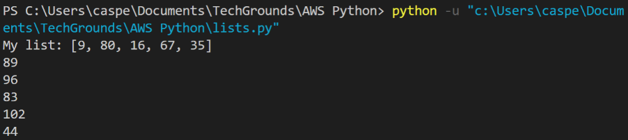

# Lists
## Introduction:
You can declare a list of values in a single variable. A list is represented by square brackets  [ ], and each value is separated by a comma.

Each position in a list has a number associated with it called the index. Indexes start at 0, so the first item in a list will have the index 0. The second item will have index 1, etc. You can call individual items in a list by calling its index.

You can loop over a list using a for loop. Instead of a number within a range, i (or whatever you name the variable you declare) will have the value of an item in the list. You can still use range() to loop over a list. In this case, i will be used to call an index in a list.
## Requirements:
* Python
* VS Code


## Key-terms
**Lists:**
Lists are used to store multiple items in a single variable.

Lists are one of 4 built-in data types in Python used to store collections of data, the other 3 are Tuple, Set, and Dictionary, all with different qualities and usage.

Lists are created using square brackets:

Example:

Create a List:
```
thislist = ["apple", "banana", "cherry"]
print(thislist)
``` 

List items are ordered, changeable, and allow duplicate values.  
List items are indexed, the first item has index [0], the second item has index [1] etc.

When we say that lists are ordered, it means that the items have a defined order, and that order will not change.  

If you add new items to a list, the new items will be placed at the end of the list.

**Loop Through a List**  
You can loop through the list items by using a for loop:

Example:  

Print all items in the list, one by one:  
```
thislist = ["apple", "banana", "cherry"]
for x in thislist:
  print(x)
```

## Opdracht
### Gebruikte bronnen
https://www.w3schools.com/python/python_lists.asp
https://www.w3schools.com/python/python_lists_loop.asp
### Ervaren problemen

### Resultaat

**Exercise 1:**  
* Create a new script.
* Create a variable that contains a list of five names.
* Loop over the list using a for loop. Print every individual name in the list on a new line.
Example output:


```
names = ["Rogier", "Jennifer", "Anj", "Sjoerd", "Akram"]

for i in names:
    print(i)
```
*output:*
```
python3.11.exe c:/Users/TechGrounds/Documents/GitHub/techgrounds-JonBoers/10-16_PRG/PRG-07ex1.py
Rogier
Jennifer
Anj
Sjoerd
Akram
```

**Exercise 2:**  
* Create a new script.
* Create a list of five integers.
* Use a for loop to do the following for every item in the list:  
Print the value of that item added to the value of the next item in the list. If it is the last item, add it to the value of the first item instead (since there is no next item).  
Example output:


The first result above is created by adding 9 and 80. The second result is created by adding 80 and 16, etc. The last result is created by adding 35 and 9.

```
def add_items_in_list(lst):
    result = []
    for i in range(len(lst)):
        result.append(lst[i] + lst[(i + 1) % len(lst)])
    return result

integers = [34, 78, 3, 20, 12]
print("integers = ", integers)

result_list = add_items_in_list(integers)
for i in result_list:
    print(i)
```
*output:*
```
python3.11.exe c:/Users/TechGrounds/Documents/GitHub/techgrounds-JonBoers/10-16_PRG/PRG-07ex2.py
integers =  [34, 78, 3, 20, 12]
112
81
23
32
46
```


