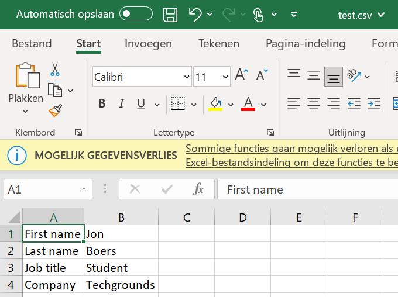

# Key-value pairs
## Introduction:  

Key-value pairs are a general concept you will definitely encounter. Some examples of where you will find them are NoSQL databases or AWS/Azure resource tags. Dictionaries (dict) in Python also use key-value pairs to store information.

Dicts in Python are written using curly brackets {}. You can get values from the dict by calling its key. 
Requirements:
* Python
* VS Code


## Key-terms

Dictionary:

Dictionaries are used to store data values in key:value pairs.

A dictionary is a collection which is ordered*, changeable and do not allow duplicates.

*As of Python version 3.7, dictionaries are ordered. In Python 3.6 and earlier, dictionaries are unordered.

Dictionaries are written with curly brackets, and have keys and values:

Example:  

Create and print a dictionary:  
```
thisdict = {
  "brand": "Ford",
  "model": "Mustang",
  "year": 1964
}
print(thisdict)
```
To iterate dictionary key-value pairs, use the items() method.

Built-in Types - dict.items() — Python 3.11.3 documentation  
```
for k, v in d.items():
    print(k, v)
```

## Opdracht
### Gebruikte bronnen
https://www.w3schools.com/python/python_dictionaries.asp  
https://note.nkmk.me/en/python-dict-keys-values-items/#:~:text=In%20Python%2C%20to%20iterate%20through,those%20methods%20and%20list()%20.&text=You%20can%20iterate%20keys%20by,object%20in%20a%20for%20loop.  
### Ervaren problemen

The syntax for writing a dictionary to a .csv file was quite complicated. For example this line:

```
f.write("%s,%s\n" % (key, input_dictionary[key]))
```
..was hard to comprehend;

A breakdown step by step:
```
f.write(): 
```
This line calls the write() method on the file object f. The write() method is used to write data to a file.

```
"%s,%s\n": 
```
This is a string that serves as a format template. The %s is a placeholder that indicates where the values will be inserted. It specifies that the values will be strings. The ,%s\n adds a comma , between the two values and a newline character \n at the end.

```
% (key, input_dictionary[key]): 
```
This part is called string formatting. The % operator is used to substitute the placeholders in the format template with the actual values. In this case, it replaces the first %s with the value of key and the second %s with the value corresponding to key in the input_dictionary.

```
key: 
```

It refers to the key variable, which represents the current key of the dictionary during the loop iteration.

```
input_dictionary[key]: 
```

It retrieves the value corresponding to the current key from the input_dictionary.

So, overall, this line is writing the key-value pair from the dictionary to a file, where the key and value are formatted as strings separated by a comma, followed by a newline character. The % operator is used to substitute the values into the format template before writing them to the file.

### Resultaat
**Exercise 1:**  

* Create a new script.
* Create a dictionary with the following keys and values:
    
| Key        | Value          |
| ---------- | -------------- |
| First name | Casper         |
| Last name  | Velzen         |
| Job title  | Learning coach |
| Company    | Techgrounds    |

* Loop over the dictionary and print every key-value pair in the terminal.  

```
new_dictionary = {
    "First name": "Casper",
    "Last name": "Velzen",
    "Job title": "Learning coach",
    "Company": "Techgrounds"
}
for k, v in new_dictionary.items():
    print(k, ":", v)
```
*output:*

```
python3.11.exe c:/Users/TechGrounds/Documents/GitHub/techgrounds-JonBoers/10-16_PRG/PRG-08ex1.py
First name : Casper
Last name : Velzen
Job title : Learning coach
Company : Techgrounds
```

**Exercise 2:**

* Create a new script.
* Use user input to ask for their information (first name, last name, job title, company). Store the information in a dictionary.
* Write the information to a csv file (comma-separated values). The data should not be overwritten when you run the script multiple times.

```
First_name = input("What is your first name?")
Last_name = input("What is your last name?")
Job_title = input("What is your job title?")
Company = input("What is your company?")

input_dictionary = {
    "First name": First_name,
    "Last name": Last_name,
    "Job title": Job_title,
    "Company": Company
}

for k, v in input_dictionary.items():
    print(k, ":", v)
    
import csv

with open('test.csv', 'w') as f:
    for key in input_dictionary.keys():
        f.write("%s,%s\n"%(key,input_dictionary[key]))
```
*output:*
```
python3.11.exe c:/Users/TechGrounds/Documents/GitHub/techgrounds-JonBoers/10-16_PRG/PRG-08ex2.py
What is your first name?Jon
What is your last name?Boers
What is your job title?Student
What is your company?Techgrounds
First name : Jon
Last name : Boers
Job title : Student
Company : Techgrounds
```

File test.csv was created:



...and when I ran the script a 2nd time access to the test.csv was denied and not overwritten:

```
python3.11.exe c:/Users/TechGrounds/Documents/GitHub/techgrounds-JonBoers/10-16_PRG/PRG-08ex2.py
What is your first name?Jonas
What is your last name?Brothers
What is your job title?nunyobeezwax
What is your company?Techgrounds
First name : Jonas
Last name : Brothers
Job title : nunyobeezwax
Company : Techgrounds
Traceback (most recent call last):
  File "c:\Users\TechGrounds\Documents\GitHub\techgrounds-JonBoers\10-16_PRG\PRG-08ex2.py", line 18, in <module>
    with open('test.csv', 'w') as f:
         ^^^^^^^^^^^^^^^^^^^^^
PermissionError: [Errno 13] Permission denied: 'test.csv'
``` 