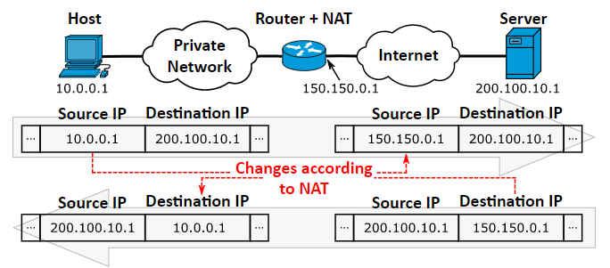
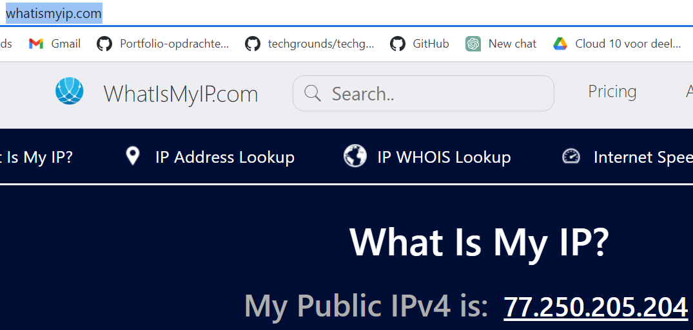
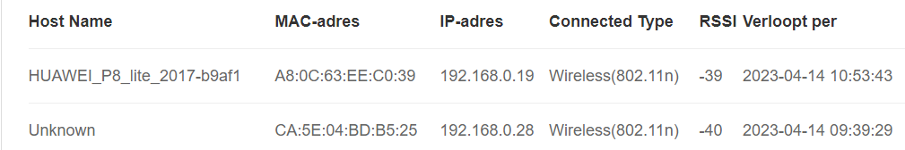
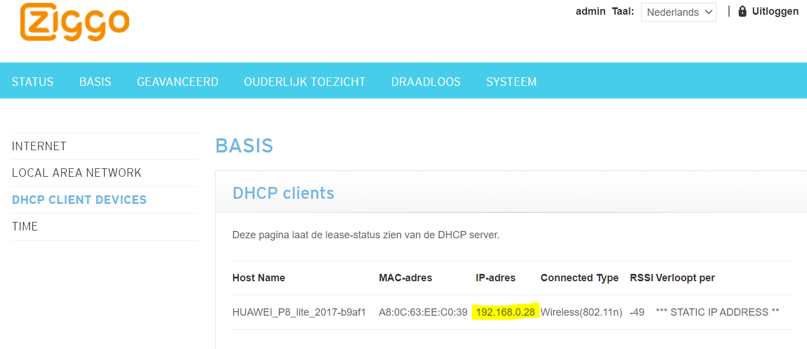
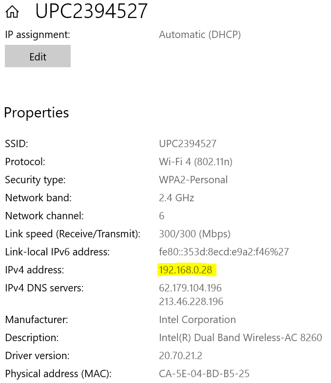
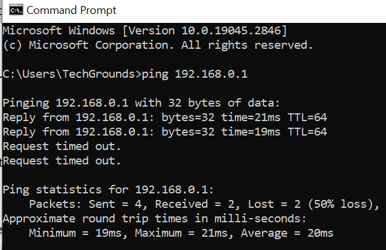

# [IP adressen]

Introductie:
Een IP adres is een logisch adres dat aan een netwerkapparaat toegewezen kan worden. De netwerkapparaten kunnen dan vervolgens met dit IP adres elkaar vinden op het netwerk.
Een IPv4 adres heeft 32 bits (4 bytes), en is meestal geschreven in decimalen (bijvoorbeeld: 132.88.142.5) waar iedere blok voor, na, en tussen de punten, 1 byte is. Dit betekent dat één blok tussen punten een maximale waarde kan hebben van 255. 

Het is wijd en zijd bekend in de ICT dat alle IPv4 adressen op zijn. De 4 bytes in een IPv4 adres maakt het mogelijk dat er 4,294,967,296 IPv4 adressen mogelijk zijn. En deze zijn allemaal al verkocht of gereserveerd. Mocht je interesse hebben wie jouw publieke IP adres mocht bezitten, dit is op te zoeken op met een whois-check.

Het originele idee dat iedere computer op het internet met ieder een eigen publiek IP(v4) adres aanspreekbaar is, is al lang niet meer zo. Over de jaren heen zijn er een aantal maatregelen genomen om nog langer met IPv4 te kunnen werken. Zo heb je als gebruiker van het internet, achter je modem, maar één publiek IP adres dat je deelt met alle apparaten op het netwerk. Dit is mogelijk vanwege een NAT-tabel in je modem. Een NAT-tabel houd bij welke verbindingen de apparaten in je privé netwerk maken met het publieke internet en zorgt er dan voor dat data als antwoord naar de juiste computers gestuurd worden.

Er zijn 3 IP adres bereiken gereserveerd voor privé netwerken. Iedereen gebruikt één van deze netwerken thuis of op werk. Deze zijn:
192.168.0.0 - 192.168.255.255
172.16.0.0 - 172.31.255.255
10.0.0.0 - 10.255.255.255

Een andere oplossing is IPv6. IPv6 adressen bevatten 128 bits, en is vaak geschreven in hexadecimalen. Het aantal adressen dat mogelijk is met IPv6 zo groot, dat je iedere korrel zand op alle stranden van onze aarde 3 IPv6 adressen kan geven voordat deze op is. Of dat is het verhaal wat vaak verteld wordt bij de voordelen van IPv6 over IPv4.

Wij focussen ons op IPv4. Ondanks dat de transitie naar IPv6 noodzakelijk is, gebruikt AWS en Azure nog steeds voornamelijk IPv4 en is IPv6 een aparte optie die expliciet aangezet moet worden.
Bestudeer:
IP adressen
IPv4 en IPv6
Public en Private IPs
NAT
Statische en dynamische adressen

Benodigdheden:
Je laptop
Je mobiel
Admin toegangsgegevens voor je router

## Key-terms

NAT-tabel; Network address translation (NAT) is a method of mapping an IP address space into another by modifying network address information in the IP header of packets while they are in transit across a traffic routing device.[1] The technique was originally used to bypass the need to assign a new address to every host when a network was moved, or when the upstream Internet service provider was replaced, but could not route the network's address space. It has become a popular and essential tool in conserving global address space in the face of IPv4 address exhaustion. One Internet-routable IP address of a NAT gateway can be used for an entire private network.

## Opdracht
### Gebruikte bronnen
https://www.whatismyip.com/
https://en.wikipedia.org/wiki/Network_address_translation
https://learningnetwork.cisco.com/s/question/0D53i00000Kt30yCAB/why-use-dhcp-when-you-can-just-use-nat

### Ervaren problemen

Kwam er maar niet achter waar ik mijn ip adres op mijn telefoon kon veranderen, maar na wat zoeken bleek dat ik moest tappen en vasthouden voordat geavanceerde wifi opties zichtbaar werden. Vervolgens kon ik mijn ip adres niet aanpassen omdat de 'opslaan'-knop niet oplichtte. Uiteindelijk het wifi netwerk 'vergeten' (gewist), handmatig aangemaakt en na het invullen van alle parameters inclusief dns1 lichtte de 'verbinden' knop op en hadden mijn laptop en mobiel hetzelfde ip adres. Helaas kon ik dat niet overzichtelijk krijgen in de GUI van mijn router, maar kon ik het wel bewijzen door in de wifi intellingen van mijn laptop te kijken.

### Resultaat

Opdracht:

**Ontdek wat je publieke IP adres is van je laptop en mobiel op wifi.**

**Zijn de adressen hetzelfde of niet? Leg uit waarom.**

De adressen zijn hetzelfde omdat het hier om mijn **publieke** IP adres gaat. Het onderscheid tussen mijn apparaten (**prive IP adres**) wordt gemaakt door DHCP.  Mijn prive IP adressen worden door het NAT protocol omgezet naar 1 publiek IP adres. Gezien het tekort aan IPv4 adressen is dit relevant.

**Ontdek wat je privé IP adres is van je laptop en mobiel op wifi.Zijn de adressen hetzelfde of niet? Leg uit waarom.**

 De adressen zijn niet hetzelfde zodat er onderscheid is en er geen conflicten ontstaan. Zie ook onderwerp DHCP <> NAT.

**Verander het privé IP adres van je mobiel naar dat van je laptop. Wat gebeurt er dan?**

Helaas niet zichtbaar in de gui van mijn router;

... maar blijkt dit wel uit de wifi instellingen op mijn laptop:

Als experiment met mijn terminal gepingd en er wordt een 50% verlies gemeld door time-out. Ook wel weer grappig om te zien:

Beide apparaten werden ook zeer traag in de browsers.

**Probeer het privé IP adres van je mobiel te veranderen naar een adres buiten je netwerk. Wat gebeurt er dan?**

Zomaar een random ip ingevuld: 254.23.45.234 Gek genoeg bleef mijn mobiel wel verbinding houden met mijn router, maar bij het opstarten van de NOS-app kreeg ik de melding; ! Geen internettoegang

Tip: vergeet niet je instellingen weer terug te zetten wanneer je klaar bent met de opdracht.

